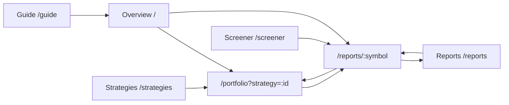

# SNUSMIC Portfolio Lab Design Contract

Last updated: 2026-05-13

This document is the source of truth for product, IA, data ownership, UI/UX, and content decisions in this repository. It supersedes ad-hoc page-level interpretations when they conflict.

## 1. Source of truth

SNUSMIC Portfolio Lab is a static, artifact-backed research and portfolio validation product. The Python pipeline owns data refresh, price matching, simulation, strategy search, and artifact export. The Next.js app reads prepared artifacts and renders product views.

Do not let pages infer business taxonomy from string names. Strategy/benchmark/report/portfolio semantics must come from exported artifacts or shared domain functions.

## 2. Brand and product frame

Product name: **SNUSMIC Portfolio Lab**.

The product is a portfolio research lab for:

- research-report validation,
- share-based portfolio ledger review,
- benchmark comparison,
- selectable strategy review,
- research-derived candidate screening.

The product is not a live trading terminal, broker app, order-entry UI, black-box recommender, or market-data streaming app.

User-facing language should sound like a finance product, not an implementation note. Prefer:

- 기준 데이터
- 읽기 전용
- 리포트 검증
- 포트폴리오 원장
- 전략 비교
- 벤치마크
- 가격 확인
- 목표가 진행
- 낙폭 점검

Avoid exposing implementation terms as product copy unless shown in a technical/data-quality panel:

- Static Artifacts
- canonical artifact
- schema
- data/web
- commit 기준
- generated artifact
- simulation artifact

The dashboard may mention that it is read-only and not a live trading product, but this should be concise and product-safe rather than developer-flavored.

## 3. User jobs and page ownership

Navigation and page jobs are fixed:

| Page | Primary user question | Owns | Must not duplicate |
| --- | --- | --- | --- |
| Overview | “30초 안에 현재 상태와 최고 전략이 어떤가?” | selected/best strategy snapshot, portfolio state, objective gate, concise research pulse | full report table, full strategy table, full trade ledger |
| Portfolio | “이 전략은 무엇을 어떻게 사고팔았나?” | persona/strategy selector, holdings, cash, trades, position lifecycle, buy/sell reason | benchmark taxonomy invention, report ranking UI |
| Research | “리포트가 실제로 맞았나?” | target-price validation, price-matched report table, ranking presets over one table | separate inconsistent ranking cards/tables |
| Strategies | “어떤 전략이 기준선을 이겼고 규칙은 무엇인가?” | benchmark set, selectable strategies, strategy methodology/params, objective gate, series comparison | trade-ledger details already owned by Portfolio |
| Screener | “지금 다시 검토할 후보는 무엇인가?” | explainable report-derived candidates and filters | black-box buy recommendations |
| Guide | “무엇을 어떻게 읽어야 하나?” | interactive onboarding, metric definitions, example workflow, terminology | live trading or investment advice |

Menu labels and route labels must match. If the route is `/reports`, the sidebar should say Reports or Research consistently with the page title/link copy. Do not mix “리서치 메뉴” with “리포트 링크” in a way that creates mismatched mental models.

## 4. Data ownership and physical separation

The frontend should not assemble page products by pulling every artifact into one giant model. Export page-oriented bundles that preserve domain boundaries.

Current physical data surface:

```text
data/web/
  manifest.json
  overview/
    snapshot.json
    research-pulse.json
    data-quality.json
  portfolio/
    personas.json
    holdings.json
    monthly-holdings.json
    trades.json
    episodes.json
    equity-daily.json
  reports/
    table.json
    rankings.json
    detail-metrics.json
    return-windows.json
    target-hit-distribution.json
  strategies/
    catalog.json
    leaderboard.json
    curves.json
  screener/
    candidates.json
```

Top-level artifacts may remain as raw/download surfaces during the cutover, but route-level product code should use page-owned readers. Do not introduce legacy/fallback/deprecated wrappers. If the new artifact is required, validate it and fail clearly when missing.

The most important new contract is the **strategy catalog**:

```text
strategy_id
label
short_label
kind: benchmark | strategy | oracle
benchmark_group: allocation | follower | market | oracle | null
is_selectable
is_default_candidate
objective_passed
objective_return_excess
objective_mdd_slack
methodology_summary
buy_rules[]
sell_rules[]
risk_controls[]
params
metrics
```

Pages consume strategy meaning from this catalog. They must not hardcode that `smic_follower_v2` is the primary portfolio or that `smic_mtt_strategy_top1` means a top strategy.

## 5. Benchmark/strategy taxonomy

Benchmarks are comparison baselines, not user-selectable proprietary strategies:

1. All-Weather
2. SMIC Follower v1
3. SMIC Follower SL/v2
4. KODEX 200 / KOSPI proxy
5. QQQ / NASDAQ-100 proxy
6. SPY / S&P 500 proxy
7. GLD / gold proxy
8. Weak Prophet / future-information upper-bound baseline

Everything else is a selectable strategy unless explicitly marked otherwise by the strategy catalog.

Weak Prophet should be visibly separated as an oracle/future-information baseline. It is allowed to be intentionally strong because its purpose is an upper-bound reference, not a tradable strategy.

The personal objective gate is:

```text
MDD <= 15% and return > KODEX 200 / KOSPI proxy
```

This gate must be shown on strategy comparisons and should drive the default “best strategy” choice only after the taxonomy is clear.

## 6. UI/UX principles

1. **One data set, one table.** Ranking modes change sort/filter state on a unified table. They do not create different columns for the same rows.
2. **Every scalable table has controls.** Search/filter, sortable headers, pagination or row windowing, sticky header, right-aligned numeric cells, internal horizontal scroll.
3. **No page-level horizontal overflow.** Long strategy names, Korean labels, and company names must truncate or wrap within their container.
4. **Cards summarize; tables decide.** Cards can preview top-N, but the full decision surface is a unified table.
5. **Charts are controllable.** Multi-series performance charts need on/off controls because benchmark and strategy labels otherwise crowd the view.
6. **Cash is an asset class.** Portfolio value includes cash; treemaps include cash when nonzero.
7. **Methodology is visible.** Strategy pages and portfolio strategy views must explain buy/sell rules, not just show returns.
8. **Content is user-facing.** Avoid AI-slop/product-internal phrases. If a phrase exists only because an engineer reasoned it out, rewrite it as a user benefit or remove it.
9. **No silent exclusions.** If missing-price, sell-opinion, or instant-listing-hit reports are excluded from validation, expose counts in data quality, but keep the user table focused on actionable rows.
10. **Interactivity teaches.** Guide/onboarding should use interactive examples, not a static wall of documentation.

## 6.1 Navigation contract

The canonical route/link map lives in `docs/navigation-architecture.md`.



Navigation rules:

- Strategy and benchmark rows open the selected ledger view: `/portfolio?strategy=:id`.
- Report rows, screener candidates, trade-basis links, and report-backed heatmap tiles open `/reports/:symbol`.
- Cash and benchmark-only holdings without a matched report stay non-clickable.
- Guide links are onboarding shortcuts, not duplicated primary CTAs.

## 7. Visual language

Light fintech SaaS. White panels, soft blue-gray background, restrained blue/purple accents, strong tabular numbers, compact badges, clear section hierarchy. Avoid dark HTS/Bloomberg clone aesthetics.

Overview should not feel like a developer status page. If the top cards become too small to read, collapse them into a single executive summary panel or remove them.

## 8. Component ownership

Preferred shared components:

- `StrategySelector`: one selector used by Overview, Portfolio, and Strategies.
- `SeriesToggleChart`: one chart shell with visible series controls.
- `StrategyMethodCard`: rules/params explanation for MTT and other strategies.
- `UnifiedDataTable`: sortable/filterable/paginated table shell.
- `TargetProgressBar`: consistent target progress visualization.
- `ValueDelta`: consistent signed metric rendering.
- `DataQualityNotice`: concise exclusions/coverage explanation.

Do not create page-specific duplicates when one shared domain component would keep interpretation aligned.

## 9. Accessibility and responsiveness

- Status is text + color, never color-only.
- Tables remain semantic tables.
- Chart and treemap panels have captions or aria-labels.
- Controls have visible focus states.
- Mobile stacks sections; tables scroll inside their wrappers.
- Desktop is dense but not cramped.

## 10. Implementation constraints

- No new dependencies unless explicitly approved.
- No live market API fetches in the web runtime.
- No external runtime scraping inside page rendering.
- Scraping/reference capture, if added for UI inspiration, belongs in scripts/docs and must not become app runtime behavior.
- Fast-fail required artifacts. Do not add fallback/legacy/deprecated branches.
- Prefer deletion and consolidation over wrapper layers.

## 11. Open direction

The current codebase can evolve through staged cuts rather than a one-shot rewrite:

1. Consolidate Reports ranking cards and the Reports table into one preset-driven table.
2. Replace duplicated strategy selectors/tables with shared components.
3. Collapse remaining top-level raw artifacts into download-only surfaces.
4. Keep the interactive Guide page aligned with the navigation contract.
5. Continue removing primary-page developer copy in favor of user-facing finance language.
