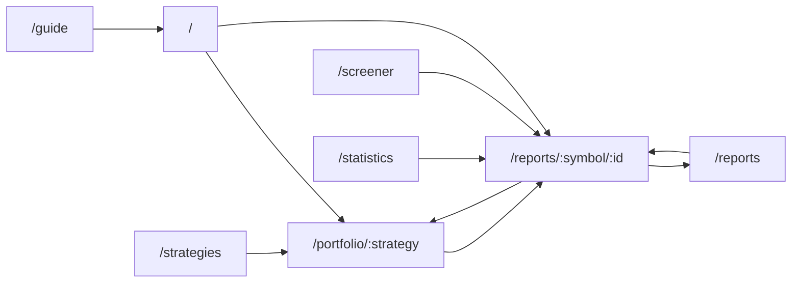

# SNUSMIC Portfolio Lab — Design Notes

Last updated: 2026-05-22
Status: code-traced design notes. The implementation and exported artifacts are the source of truth for runtime behavior; `docs/product-spec.md` is the source of truth for product intent.

---

## 0. How to read this document

Each section still carries historical stability tags, but they are not higher authority than code.

- **[FIXED]** — stable design intent. If code and this text disagree, inspect code first and update this document or open an implementation task.
- **[GUIDELINE]** — a principle. Pages may diverge when the current implementation has a clear reason.

Per-section revision markers (`<!-- rev: YYYY-MM-DD -->`) record the last substantive change to that section.

---

## 1. Product frame [FIXED]

<!-- rev: 2026-05-22 -->

SNUSMIC Portfolio Lab is an artifact-backed active trading backtest lab for a salaried-worker savings account. It asks whether an investor who relies on SMIC for stock coverage, but chooses their own buy/sell/position-management rules, could beat All-Weather using daily-close data.

It is **not**: a trading terminal, broker app, order-entry UI, black-box recommender, market-data feed, live signal product, or report-author grading scoreboard.

The tone is **research ledger, not pitch**. We log what happened, preserve failed experiments, and separate account-level strategy evidence from report-level labels.

One-line product sentence:

> SMIC 커버 종목만으로 직장인 적립식 계좌가 올웨더보다 더 벌 수 있는지 검증하는, 일별 종가 기준 액티브 매매 백테스트 원장.

---

## 2. Reader and retail questions [GUIDELINE]

<!-- rev: 2026-05-19 -->

Default reader: a Korean retail investor (개인 투자자) who is not the author of any report. Secondary readers: club members, financial-industry visitors, prospective members. Page copy must answer the retail reader's questions, not the maintainer's.

Retail questions per page (this drives section §3):

| 페이지 | Retail이 던지는 질문 |
| --- | --- |
| `/` (Overview) | 이 사이트 누구? 학부생인데 봐도 돼? 지금 뭐가 잘 됐고 뭐가 망했나? |
| `/portfolio` | 실제 포트폴리오 전략을 따라가면 어떤 보유·현금·매매가 남나? |
| `/reports` | 이 종목 지금 사도 돼? 늦었나? 얼마나 갔다 왔어? |
| `/reports/[symbol]/[id]` | 이거 발간일에 샀으면 지금 얼마? 최악은 언제? 그때 팔았어야? |
| `/statistics` | 망한 케이스 공통점은? 사면 안 됐던 패턴? 어떤 신호가 미리 보였나? |
| `/screener` | 비슷한 케이스 중 망한 건 뭐? 지금 후보 어떻게 거를까? |
| `/strategies` | 어떤 룰이 작동했고, benchmark와 어떻게 달랐나? |
| `/guide` | 이 수치 못 믿을 이유는? 어디서 왜곡될 수 있나? |

Reader assumption: 매도 타이밍을 모델이 알려줄 수 없다. 우리는 "비슷한 케이스가 어떻게 끝났는지"만 보여준다.

---

## 3. Pages and ownership [FIXED]

<!-- rev: 2026-05-19 -->

| Page | Type | Primary retail question | Owned data |
| --- | --- | --- | --- |
| `/` | Dashboard | 지금 상태와 어디가 잘/안 됐나 | snapshot · selected strategy · objective gate · recent reports · recent trades |
| `/portfolio` | Dashboard + dossier | 실제 전략 포트폴리오 선택, 현재 비중, 손익 경로 | selectable strategy portfolios · allocation treemap · optimization frontier · equity/trade markers; benchmark/follower/oracle excluded |
| `/reports` | Index | 어떤 리포트들? | report table with target/result columns |
| `/reports/[symbol]/[id]` | Detail | 이 리포트는 어떻게 됐나 | report detail · price path · facts · scenario table |
| `/statistics` | Analytics | 전체 리포트가 어떻게 끝났고 어떤 패턴? | derived stats only — feeds off artifacts, doesn't own state |
| `/screener` | Index | 지금 검토할 후보는? | research-derived candidates · filters |
| `/strategies` | Index | 전략과 benchmark가 어떻게 다르나? | strategy/benchmark catalog · leaderboard · curves · comparison-only role cards |
| `/guide` | Detail | 어떻게 읽어야? | onboarding · definitions |

Page types defined in §7. Menu labels and route labels must match.

---

## 4. Data ownership and runtime contracts [FIXED]

<!-- rev: 2026-05-19 -->

### 4.1 Pipeline vs frontend split

Python pipeline owns: data refresh, price matching, simulation, strategy search, artifact export. Next.js app reads artifacts, computes server-side derived stats where needed, and renders.

Pages do not infer business taxonomy from string names. Strategy/benchmark/report meaning must come from exported artifacts or shared domain modules.

### 4.2 Physical artifacts

```text
data/web/
  manifest.json
  overview/        snapshot.json · research-pulse.json · data-quality.json
  portfolio/       personas.json · holdings.json · monthly-holdings.json · trades.json · episodes.json · equity-daily.json
  reports/         table.json · rankings.json · detail-metrics.json · return-windows.json · target-hit-distribution.json
  strategies/      catalog.json · leaderboard.json · curves.json
  screener/        candidates.json
  prices/          {SYMBOL}.json   (full daily OHLCV)
  report-statistics-lab.json
```

Routes use page-owned readers. Required artifacts fail loudly when missing; do not add fallback/legacy/deprecated wrappers.

### 4.3 Strategy catalog contract

```text
strategy_id · label · short_label
kind: benchmark | strategy | oracle
benchmark_group: allocation | follower | market | oracle | null
is_selectable · is_default_candidate
objective_passed · objective_return_excess · objective_mdd_slack
methodology_summary · buy_rules[] · sell_rules[] · risk_controls[]
params · metrics
```

Pages should prefer catalog-derived strategy meaning over hardcoding that `smic_follower_v2` is the primary portfolio or that a specific id is the "best". If current code diverges, code is the audit target.

### 4.4 Return-metric contracts on `/statistics`

These are the runtime semantics enforced by `app/(app)/statistics/page.tsx`. All other pages that surface return numbers must follow the same window/metric definitions.

- **Validity window**: 발간일 + **500 trading days** (≈ 2 calendar years). Everything beyond this point is out of scope.
- **maxFavorableExcursion (MFE)**: 윈도우 내 일중 고가(`highKrw`)의 최댓값 ÷ 발간일 종가(KRW) − 1. "한 번이라도 도달한 최대 폭".
- **expiryReturn**: 윈도우 마지막 날 종가 ÷ 발간일 종가 − 1. 윈도우가 아직 끝나지 않은 (진행 중) 리포트는 `null`.
- **hit10/08/06**: 윈도우 내 일중 고가가 목표가의 1.0x / 0.8x / 0.6x를 한 번이라도 넘었는가.
- **daysToTarget**: 윈도우 내 첫 도달일 (없으면 `null`).
- 종가 환산은 항상 `close_krw` 우선. 일중 KRW 환산은 `high * (close_krw / close)`.

### 4.5 Outcome classification [FIXED]

여섯 단계. 도달 여부 우선 → 상승 기회 → 만료 종가 순.

```text
target       hit10                                                  → blue
partial      hit08 || hit06                                          → violet
upside       not hit, MFE >= +30%                                    → teal
flat         not hit, |expiryReturn| < 10% AND MFE < 30%             → slate
declining    not hit, -30% < expiryReturn <= -10%                    → amber
devastating  not hit, expiryReturn <= -30%                           → rose
```

여기서 `devastating`은 "매수해서 거의 못 오르고 만료까지 깊게 하락한" 케이스. 이 분류는 리테일 핵심 위험 지표라서 별도 카테고리.

### 4.6 Server-side derived stats boundary

| 위치 | 무엇 |
| --- | --- |
| Artifact (Python) | 가격 시리즈, 시뮬레이션 산출물, 리포트 메타데이터, 변경 빈도가 낮은 수치 |
| Server component (`page.tsx`) | derived metric (r5/r10/r20, SMA 정배열, 52w high 비율, Mann-Whitney U, 조기 손절 규칙, MFE/expiry windowing) |
| Client component | 토글, 선택, hover, 강조 |

원칙: 정렬·필터·집계는 서버에서. 강조·선택은 클라이언트에서.

---

## 5. Strategy and benchmark taxonomy [FIXED]

<!-- rev: 2026-05-19 -->

Benchmarks (selectable=false unless oracle, presented as comparison baselines, not proprietary strategies):

1. All-Weather
2. SMIC Follower v1
3. SMIC Follower SL / v2
4. KODEX 200 / KOSPI proxy
5. QQQ / NASDAQ-100 proxy
6. SPY / S&P 500 proxy
7. GLD / gold proxy
8. Weak Prophet (oracle / future-information upper-bound baseline; visibly separated)

Everything else is a selectable strategy unless the catalog says otherwise.

Personal objective:

```text
final equity and MWR > All-Weather under the same savings cash flows
```

MDD is a secondary explainability and survivability metric, not the first objective. Strategy comparisons may still show KODEX 200, QQQ, SPY, and GLD, but the product's primary hurdle is beating All-Weather in the salaried-worker account scenario.

---

## 6. Interaction principles and navigation [FIXED]

<!-- rev: 2026-05-19 -->

### 6.1 Principles

1. **One data set, one table.** Ranking modes change sort/filter on a unified table; they don't spawn new column sets.
2. **Every scalable table has controls.** Search/filter, sortable headers, pagination or row windowing, sticky header, right-aligned numeric cells, internal horizontal scroll.
3. **No page-level horizontal overflow.** Long names truncate or wrap inside their container.
4. **Cards summarize; tables decide.** Cards preview top-N; the full decision surface is a table.
5. **Charts are controllable.** Multi-series performance charts need on/off controls.
6. **Cash is an asset class.** Portfolio value includes cash; treemaps include cash when nonzero.
7. **Methodology is visible.** Strategy and portfolio strategy views explain buy/sell rules, not just returns.
8. **No silent exclusions.** Excluded reports surface counts in data quality.
9. **Status is text + color, never color-only.**
10. **Empty data is a first-class state.** No active holdings → cash/reserve ledger, not an empty treemap.
11. **Korean labels must not be cropped.** Buttons, list controls, tabs, selectors, chips, and pagination use `min-height` + vertical padding + normal line-height rather than fixed tight heights.
12. **Trade explanations are not hover-only.** PnL markers may have tooltips, but portfolio overview must also expose a visible trade-event timeline.

### 6.2 Navigation contract



Rules:

- Only selectable strategy rows open `/portfolio/:strategy` via `portfolioStrategyHref(strategyId)`. Benchmark/follower/oracle rows are comparison objects in `/strategies`, not portfolio ledgers or portfolio links. Legacy `?strategy=:id` support is compatibility only, not primary navigation.
- `/strategies` owns comparison and benchmark context; `/portfolio` owns actual strategy ledgers. If the same entity appears in both contexts, the UI must state whether it is comparison-only or investable portfolio state.
- Report rows, screener candidates, statistics points/legends, trade-basis links, report-backed heatmap tiles open `/reports/:symbol/:id`.
- Cash and benchmark-only holdings without a matched report stay non-clickable.
- Guide links are onboarding shortcuts, never duplicated primary CTAs.

---

## 7. Page composition patterns [GUIDELINE]

<!-- rev: 2026-05-19 -->

Three composition types. A page picks exactly one.

### 7.1 Dashboard

Current-state monitoring. Multi-widget grid. Used by `/`, `/portfolio`.

```
┌──────────────────────────────────────────────────────┐
│ minimal header (h1 noun phrase + 1-line meta)        │
├──────────────────────────────────────────────────────┤
│ KPI strip (selected strategy · equity · MDD · …)     │
├──────────────────────────────────────────────────────┤
│ primary anchor (treemap · curve)  │  rail (feeds)    │
├──────────────────────────────────────────────────────┤
│ evidence board (trades · holdings · validation)      │
└──────────────────────────────────────────────────────┘
```

### 7.2 Analytics

Single-question vertical narrative. Used by `/statistics`.

```
header (h1 + meta line)
[figure component 1 — own h3 caption + 1-line takeaway]
[figure component 2 — …]
…
footer (data note, 1 line)
```

Rules:

- 외부 wrapper title 없음. 각 figure 컴포넌트의 내부 `<h3>`가 캡션.
- Figure 위 헤더에 한 줄 사실 캡션 (현재 선택값·표본 수·윈도우). bold/강조 없음.
- 인터랙티브 요소(선택·토글)는 figure 헤더 우측 또는 내부에.

### 7.3 Detail

Single-object deep view. Header + tabs/scroll. Used by `/reports/[symbol]/[id]`, `/guide`.

### 7.4 Index

Sortable/filterable single table dominating the page. Used by `/reports`, `/screener`, `/strategies`.

---

## 8. Visual language and copy [FIXED]

<!-- rev: 2026-05-19 -->

### 8.1 Single visual vision

학술지 부록(academic appendix) 톤. 화이트 패널, 헤어라인 디바이더, tabular numbers, compact rows, restrained 모노톤. 데이터가 시각 texture를 만든다. 다크 터미널·HTS·Bloomberg 클론, glossy SaaS dashboard, hero 마케팅 톤은 모두 금지.

이전 문서의 "Light fintech SaaS", "Korean fintech research command board", "Research command board"는 폐기. 단일 라벨은 **"Research archive · static ledger"**.

### 8.2 Copy contract

```text
H1:        명사구, 6~14자. 동사·수사·2인칭·motivational 금지.
           OK:  "리포트 통계"  "포트폴리오 원장"  "AAPL · 발간 후 가격"
           NG:  "여러분의 투자 인사이트를 발견하세요"

메타라인:  H1 바로 아래 한 줄. font-mono text-xs.
           예: "2026-05-19 기준 · 표본 197건 · 유효기간 500거래일 (≈ 2년)"

H3 캡션:  각 figure 위. 명사구 또는 짧은 질문형. bold 강조 없음.

본문 prose:기본 금지. 정의·방법론·한계 disclosure 한정으로 1~2문장 허용.
           강조 prose("이게 진짜 그림입니다") 절대 금지.

Eyebrow:   금지 (SaaS 잔재).

CTA:       "지금 시작하기" 류 금지. 명사형만: "리포트 보기", "원본 PDF", "전체 보기".

배지:      outcome 6단계 라벨은 사실 기술어 ("목표 도달", "치명적 손실").
           bold 강조 없음.

Disclaimer:평서문, 1인칭/감정어 없음.
           "본 자료는 SMIC 학술 활동 산출물이며 투자 권유가 아닙니다."

p-value:   숫자 + 별표. "0.034 **". "유의/비유의"는 굵게 쓰지 않는다.
```

### 8.3 Color semantics

색은 브랜드 자산이 아니라 데이터 의미에 종속.

- Outcome 6단계 (§4.5): blue · violet · teal · slate · amber · rose. 현재는 server/client mirror 구현이며, 새 재사용 지점이 생기면 공통 module로 추출한다.
- 가격 차트 (lightweight-charts): up = emerald-500, down = rose-500. 도움 라인(발간/만료)은 slate dotted.
- 강조 없음. 표·KPI에 컬러 박스를 마구 두지 않는다.

### 8.4 Chart medium

| 도구 | 언제 |
| --- | --- |
| `lightweight-charts` v5 | 시간축 × 가격, OHLCV 캔들, 멀티 라인 overlay. 줌·팬이 의미를 만들 때. |
| Custom SVG | 분포, 순위, 카테고리, 6-class outcome 막대, q-q plot 같은 정적 시각화. 인쇄 가능해야 할 때. |

---

## 9. Component ownership [GUIDELINE]

<!-- rev: 2026-05-19 -->

Preferred shared components:

- `StrategySelector` — Overview · Portfolio · Strategies가 같은 selector
- `SeriesToggleChart` — multi-series 차트 컨트롤 단일 셸
- `StrategyMethodCard` — rule/param 설명
- `UnifiedDataTable` — sortable/filterable/paginated 표 셸
- `TargetProgressBar` — 목표가 진행 시각화
- `ValueDelta` — signed metric 렌더링
- `DataQualityNotice` — 제외/커버리지 노트
- `OUTCOME_CATEGORIES` / `classifyOutcome` — currently local to `components/reports/ReportStatisticsStory.tsx`, with a server-side mirror in `app/(app)/statistics/page.tsx`. Extract only when reuse pressure appears.

Page-specific duplicates를 만들지 말고 공유 컴포넌트로 정렬.

---

## 10. Accessibility and platform constraints [FIXED]

<!-- rev: 2026-05-19 -->

- Status는 text + color (color-only 금지).
- Tables는 시맨틱 `<table>`.
- Chart·treemap 패널은 caption 또는 aria-label.
- 컨트롤에 visible focus.
- 모바일은 섹션을 stack, 표는 wrapper 내부 스크롤.
- No new runtime dependencies without explicit approval.
- No live market API in web runtime.
- No external runtime scraping.
- Required artifacts fast-fail. No fallback/legacy/deprecated branches.

---

## 11. Open questions

<!-- rev: 2026-05-19 -->

Decision pending. If empty, this section is deleted.

- [ ] 코세스 사례의 PDF 추출 버그 (`entry_price_native = 9.6` from "9,600원" 콤마 파싱). Python 파이프라인 작업, 별도 트랙.
- [ ] `/statistics` `OutcomeBreakdownPanel`의 임계값 조정 (-30% 치명적 vs -20% 등). 표본 누적 후 재검토.

### 해결됨 (2026-05-19)

- [x] ReportsTable per-column filter row — `DataPanel` chrome, sticky 2-row header, kind-driven column filters, global/dropdown/column reset.
- [x] `/portfolio/[strategy]` 객체 sub-route 분리 — overview/holdings/equity/trades/methodology URL surface, shared shell, benchmark/follower/oracle 원장 제외.
- [x] `/portfolio` UI 재정의 — 메인은 실제 전략 선택 + 현재 비중 treemap + strategy-only frontier, 상세는 report-detail식 4-KPI header + PnL chart with trade markers, holdings evidence links, Entry/Rebalance/Exit-Risk/Exceptions methodology dossier.
- [x] `/main` Dashboard의 KPI strip — `buildDecisionBrief(view).state`로 5-tile(평가액·현금비중·낙폭·기준선 대비·데이터 제외) 이미 구현돼 있음.

---

## Appendix A. Decision log

| Date | Decision | Sections affected |
| --- | --- | --- |
| 2026-05-19 | 백지 재작성. "Light fintech SaaS" 비전 폐기, "academic appendix" 톤 단일화. v0.21.x decisions(MFE 500D, expiry close, 6-class outcome, p-value, lightweight-charts OHLCV)를 §4-5에 본문 승격. | All |
| 2026-05-19 | `/statistics` 페이지를 §3 추가. Analytics 페이지 타입 신설 (§7.2). | §3, §7 |
| 2026-05-19 | Outcome 6단계 분류를 당시 디자인 문서에 승격. 현재 기준은 코드 구현을 우선한다. | §4.5 |
| 2026-05-19 | 모든 return metric의 윈도우를 500 trading days로 통일. | §4.4 |
| 2026-05-19 | 코드가 단일 truth라는 운영 원칙을 명시. ReportsTable filter row 구현 상태와 `/portfolio/:strategy` 현재 navigation을 문서에 반영. | §0, §6, §9, §11 |
| 2026-05-19 | `/strategies`는 strategy/benchmark/follower/oracle 비교 카탈로그, `/portfolio`는 실제 selectable strategy 원장으로 역할 분리. Portfolio sub-route, landing/detail UI 재설계, benchmark/follower/oracle 원장 제외를 반영. | §2, §3, §6, §11 |
| 2026-05-19 | Portfolio detail phase 2: header KPI 축소, trade marker tooltip 설명 강화, holdings evidence links, Entry/Rebalance/Exit-Risk/Exceptions methodology dossier 구조 반영. | §3, §6, §11 |

## Appendix B. What was removed from the prior version

- `§7 "Light fintech SaaS"` — 마케팅 SaaS 톤. 사용자 명시적 거부.
- `§7.1 "Major redesign direction — research command board"` — 미실현 비전. 본문 contract로 부적합.
- `§7.2 "Target desktop composition"` — Dashboard 페이지 한정 가정. Analytics 페이지에 맞지 않음. §7.1로 축소 흡수.
- `§7.3 "Redesign constraints"` — 절반은 §10으로, 절반은 폐기.
- `§7.4 "V3 research archive correction"` — 핵심 원칙은 §8.1로 흡수. 모순되는 §7과 같이 죽임.
- 중복 `§7.4 "Implementation sequencing"` — 미래 비전. 본 contract에서 제외.
- `§11 "Open direction"` placeholder — 의미 있는 항목으로 재정의 (§11).

미래 비전은 별도 `VISION.md` 또는 `docs/adr/` 폴더로 분리할 때 살릴 수 있음. 본 contract는 현재 상태만 기술.
