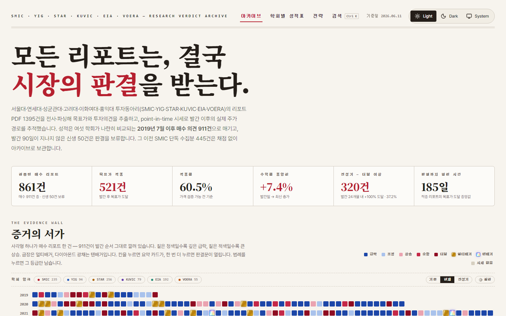
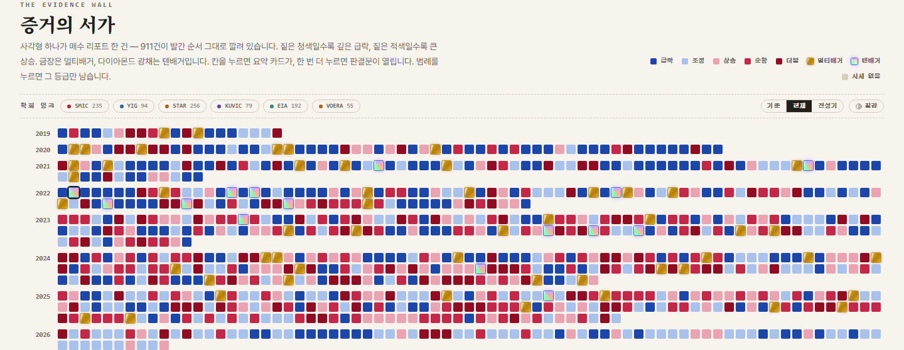
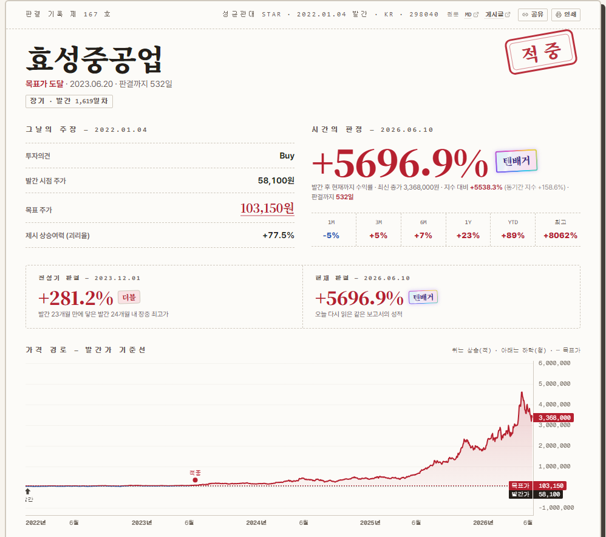
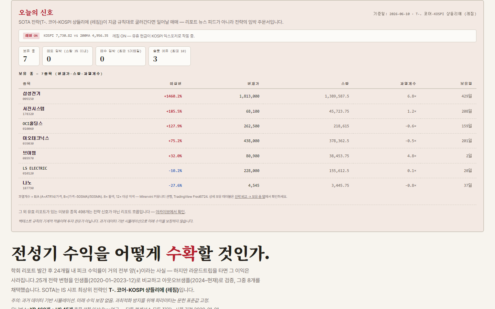
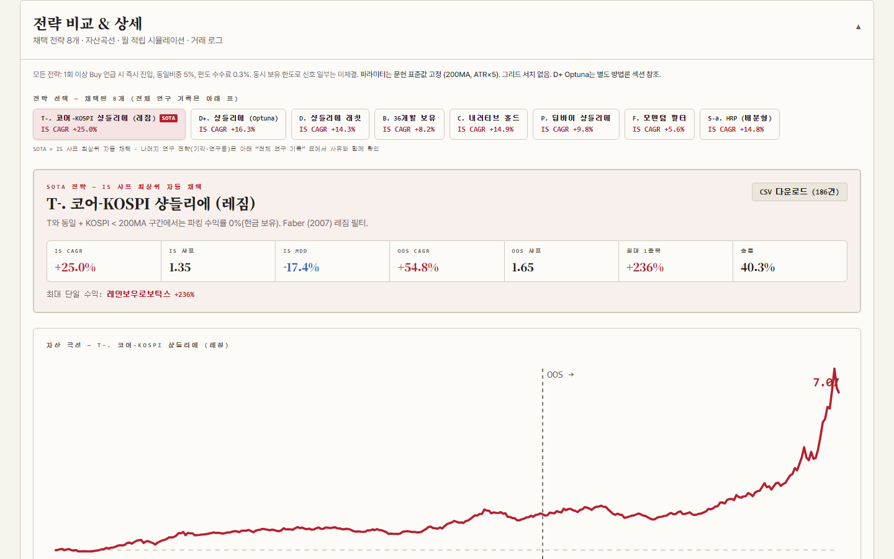
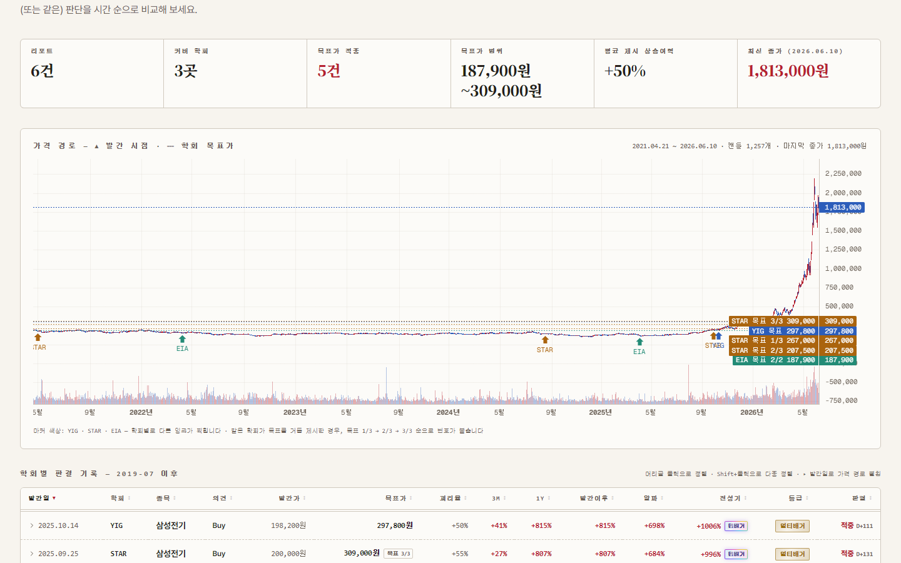
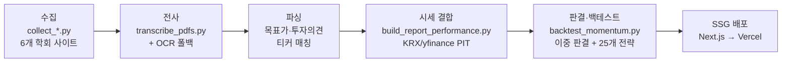

# 판결 아카이브 (Verdict Archive)

> **모든 리포트는, 결국 시장의 판결을 받는다.**

[](https://github.com/ChoiInYeol/SNUSMIC-Portfolio/actions/workflows/refresh-daily.yml)
[](https://nextjs.org)
[](https://www.python.org)
[](https://verdict-archive.vercel.app)

6개 대학 투자학회의 리서치 리포트를 **point-in-time 시세**로 검증하는 아카이브 & 전략 랩.
리포트 PDF를 전사·파싱해 목표가와 투자의견을 추출하고, 발간 이후의 실제 주가 경로로 점수를 매깁니다.

**Live: [verdict-archive.vercel.app](https://verdict-archive.vercel.app)**


*홈 — 매수 의견 911건의 성적표. 적중률 60.5%, 더블 이상 320건, 판결까지 중앙값 185일.*

## 무엇인가요

서울대 **SMIC** · 연세대 **YIG** · 성균관대 **STAR** · 고려대 **KUVIC** · 이화여대 **EIA** · 홍익대 **VOERA** —
여섯 학회가 공개한 리포트 PDF **1,569건을 수집, 1,395건을 전사·파싱**했습니다.

핵심은 *사후 판단(hindsight)이 아닌 발간 시점 기준(point-in-time)* 검증입니다.

- 여섯 학회가 나란히 비교되는 **2019년 7월 이후 매수 의견 911건**을 채점하고, 발간 90일이 지나지 않은 신생 건은 판결을 보류합니다.
- 판결은 둘로 나뉩니다 — **현재 판결**(오늘 다시 읽은 같은 보고서의 성적)과 **전성기 판결**(발간 후 24개월 내 최고점). "맞았지만 라운드트립을 탔다"가 한눈에 드러납니다.
- 모든 판결문은 원본 PDF·전사 markdown·출처 게시글로 역추적할 수 있습니다.

## 화면

| | |
|---|---|
|  |  |
| **증거의 서가** — 매수 리포트 911건을 발간 순서 그대로 깐 모자이크. 짙은 청색은 급락, 금장은 멀티배거, 다이아몬드 광채는 텐배거. | **판결문** — 그날의 주장(의견·목표가) 대 시간의 판정(현재/전성기), 도장까지. |
|  |  |
| **오늘의 신호** — SOTA 전략의 보유 종목·스탑·과열계수, 매도/매수 임박 카운트. | **전략 비교** — 25개 변형을 IS/OOS로 검증, 채택 8개의 자산곡선과 거래 로그. |


*종목 페이지 — 캔들 차트 위에 학회별 발간 시점(▲)과 목표가(점선)를 중첩. 3개 학회가 같은 종목을 어떻게 판단했는지 시간 순으로 비교.*

## 주요 기능

- **증거의 서가** — 911건의 매수 의견을 숨김 없이 전부 전시. 급락도 텐배거도 같은 벽에 걸립니다.
- **이중 판결** — 현재 판결 vs 전성기 판결. 전성기 +100% 도달 비율 37.2%(320건), 그러나 그 수익이 현재까지 남았는지는 별개의 질문.
- **전략 랩** — "전성기 수익을 어떻게 수확할 것인가"에 대한 25개 전략 변형 실험. SOTA `T-. 코어-KOSPI 샹들리에 (레짐)`은 **KOSPI 적립식(DCA) 대비 1.23×** (OOS CAGR +54.8%, OOS Sharpe 1.65).
- **오늘의 신호** — SOTA 전략이 지금 규칙대로 굴러간다면 일어날 매매. 뉴스 피드가 아니라 임박 주문서.
- **학회별 성적표** — 학회마다 최신순 장부와 연도별 요약, QA 플래그(파싱 신뢰도) 포함.
- **원문 추적** — 판결문 → 전사 markdown → 원본 PDF → 출처 게시글. 모든 숫자에 출처가 달립니다.

## 아키텍처



데이터 복구 체인: 일반 전사 → 파일명/수집 메타데이터 힌트 → 네이버 자동완성 티커 복구 → Windows OCR 표지 폴백.
사람이 검증한 교정값은 `data/sources/corrections.json`으로 유지됩니다.

## 데이터 소스

| 학회 | 학교 | 수집(PDF) | 출처 |
|---|---|---:|---|
| SMIC | 서울대학교 | 776건 | http://snusmic.com/research/ |
| STAR | 성균관대학교 | 281건 | http://starskku.com/board/board_list?code=research |
| EIA | 이화여자대학교 | 200건 | https://ewhainvest.com/research |
| YIG | 연세대학교 | 104건 | https://yig.yonsei.ac.kr/research |
| KUVIC | 고려대학교 | 104건 | https://www.kuvic.com/research |
| VOERA | 홍익대학교 | 104건 | https://www.voera.co.kr/Research |

**수집 원칙**: 각 PDF는 **1회만 다운로드**하고 SHA256 manifest(`data/sources/manifest.json`)로 관리하며,
요청 간 지연(2.5초)을 두어 원 서버에 부하를 주지 않습니다. 이메일 등 비공개 채널 수집은 하지 않습니다.

## Quick Start

```bash
npm install && npm run dev          # http://localhost:3000

# 1) 수집 (1회만 다운로드, manifest 관리, 요청 간 2.5초 지연)
.venv/Scripts/python scripts/collect_smic.py              # SMIC (증분, WP REST API)
.venv/Scripts/python scripts/collect_smic.py --full       # SMIC 전체 순회
.venv/Scripts/python scripts/collect_reports.py --source all
.venv/Scripts/python scripts/collect_kuvic_browser.py     # KUVIC (Playwright)
.venv/Scripts/python scripts/collect_ewha.py              # EIA (plain requests)
.venv/Scripts/python scripts/collect_voera.py             # VOERA (Playwright)

# 2) 전사 + OCR 폴백 (텍스트 없는 PDF 표지, Windows 전용)
.venv/Scripts/python scripts/transcribe_pdfs.py
.venv/Scripts/python scripts/ocr_fallback.py

# 3) 파싱 + 시세 결합 (.env의 KRX_ID/KRX_PW 사용, data/prices/ 증분 캐시)
.venv/Scripts/python scripts/build_report_performance.py

# 4) 종목 차트 데이터 → public/prices/{slug}.json
.venv/Scripts/python scripts/export_stock_charts.py

# 5) 전략 백테스트 (IS/OOS 분리, 민감도 그리드 포함) → src/data/strategy-backtest.json
.venv/Scripts/python scripts/backtest_momentum.py
```

## 자동 갱신

| 워크플로 | 주기 | 내용 |
|---|---|---|
| [`refresh-daily.yml`](.github/workflows/refresh-daily.yml) | 평일 18:30 KST (장 마감 후) | 증분 수집 → 새 PDF만 전사 → 데이터셋·차트·백테스트 재생성 → 커밋 |
| [`refresh-reports.yml`](.github/workflows/refresh-reports.yml) | 수동 실행 전용 | 전체 페이지 스윕(`--full`) — 수집기 복구·과거 누락 의심 시에만 |

레포 Settings → Secrets에 `KRX_ID`, `KRX_PW` 등록이 필요합니다. 갱신 커밋이 푸시되면 Vercel이 자동 재배포합니다.
운영 상세는 [`docs/OPS.md`](docs/OPS.md) 참고.

## 방법론에 대한 정직한 주석

- 백테스트는 **과거 데이터 기반 시뮬레이션**이며 미래 수익을 보장하지 않습니다. 투자 권유가 아닙니다.
- 과최적화 방지를 위해 파라미터는 문헌 표준값으로 고정하고(200MA, ATR×5 등), 인샘플(2020-01~2023-12)/아웃오브샘플(2024~현재)을 분리해 검증했습니다. 그리드 서치로 고른 전략이 아니라 IS 샤프 최상위가 자동 채택됩니다.
- 목표가·의견 파싱은 자동화되어 있어 오류가 있을 수 있습니다. 신뢰도가 낮은 건은 QA 플래그로 표시하고, 검증된 교정값만 overlay로 반영합니다.
- 2019년 7월 이전 SMIC 단독 수집분 445건은 학회 간 비교가 불공정하므로 채점 없이 아카이브로만 보관합니다.

## Legacy

이전 버전(리서치 워크스테이션, 422 커밋)은 [`legacy` 브랜치](../../tree/legacy)에 보존되어 있습니다.
파서 교정 규칙·시세 웨어하우스 등은 legacy에서 선별 이식했습니다.
