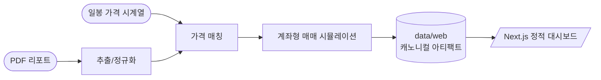
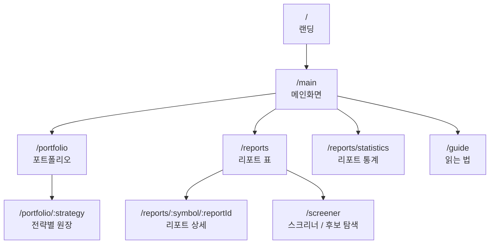
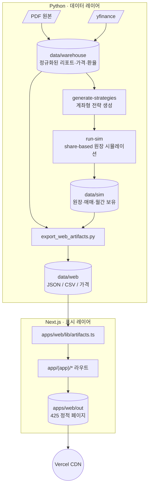

<div align="center">

# SNUSMIC Portfolio Lab

SMIC가 커버한 종목만으로 직장인 적립식 계좌를 운용했을 때,
올웨더보다 더 벌 수 있는지 검증하는 **일별 종가 기준 액티브 매매 백테스트 랩**

[](./CHANGELOG.md)
[](https://nextjs.org/)
[](https://www.python.org/)
[](https://tailwindcss.com/)
[](https://vercel.com/)
[](#)

[**라이브 →**](https://smic-portfolio.vercel.app) · [**변경 이력 →**](./CHANGELOG.md) · [**디자인 시스템 →**](./DESIGN.md)

</div>

---

## TL;DR

> 종목 리서치는 개인이 하지 않고 SMIC 커버리지에 맡깁니다.
> 알파는 언제 사고, 얼마나 사고, 언제 팔지에서 찾습니다.
> 최종 판단은 리포트 목표가 도달률이 아니라 같은 적립식 현금흐름의 계좌 원장과 올웨더 대비 초과수익입니다.



## 캐노니컬 문서

| 문서 | 역할 |
|---|---|
| [`docs/product-spec.md`](./docs/product-spec.md) | 제품 목적과 우선순위 |
| [`docs/backtest-contract.md`](./docs/backtest-contract.md) | 계좌 원장, point-in-time, no-lookahead 계약 |
| [`docs/agent-playbook.md`](./docs/agent-playbook.md) | 앞으로의 LLM/agent 작업 규칙 |
| [`docs/simplification-candidates.md`](./docs/simplification-candidates.md) | 삭제, 병합, archive 후보 |
| [`DESIGN.md`](./DESIGN.md) | UI 톤과 화면 설계 |

## 핵심 기능

| 영역 | 무엇을 보여주나 |
|---|---|
| **적립식 계좌 백테스트** | 초기 자본과 월별 적립금으로 만든 실제 share-based 원장 |
| **SMIC pool 운용** | 리포트 발간 이후 pool에 들어온 종목을 candidate, buy, sell로 나누어 검증 |
| **전략 비교** | 올웨더·시장 ETF·단순 SMIC 추종 대비 MWR, 최종 평가액, 순손익 비교 |
| **리포트 검증** | 발간가 → 목표가 약속이 실제 가격 경로에서 어디까지 도달했는지 보조 분석 |
| **후보 탐색** | 스크리너 — 컬럼별 연산자 필터(`>=100`, `<=-10`, `>=2025-01-01`), 프리셋 10종, j/k 키보드 이동 |
| **리포트 통계** | 도달률·중앙값·경로 분포·익절선 검정. 전략 선택의 보조 증거 |
| **명령 팔레트** | `⌘K` / `Ctrl+K` — 페이지·전략·종목 한 곳에서 점프 |

## 화면 구조



## 데이터 파이프라인



각 화면은 `data/web/*` 캐노니컬 아티팩트만 읽습니다. 필수 아티팩트가 빠지면 빌드가 즉시 실패합니다.

## 키보드 단축키

| 키 | 동작 |
|---|---|
| `⌘K` / `Ctrl+K` | 명령 팔레트 (페이지 + 전략 + 종목 검색) |
| `/` | 스크리너·리포트 표 검색 입력 포커스 |
| `Esc` | 검색 비우기 / 드로어 닫기 |
| `j` / `k` | 리포트 표 행 이동 |
| `Enter` | 활성 행 상세 페이지 진입 |

## 접근성

| 항목 | 적용 |
|---|---|
| Skip link | `본문으로 건너뛰기` — 모든 페이지 첫 포커스 |
| 모바일 드로어 | 포커스 트랩 + Esc 닫기 + 이전 포커스 복원 |
| 정렬 헤더 | `aria-sort="ascending/descending/none"` |
| 필터 변경 | `aria-live="polite"`로 결과 수 안내 |
| 트리맵 | Canvas 옆 `sr-only` 보유 종목 리스트 (종목·평가액·비중·미실현) |
| 색 대비 | `--faint` `#6a7480` (AA 4.7:1), focus outline `--accent-strong` |
| 모션 | `prefers-reduced-motion`에서 transition 완전 차단 |

## 빠른 시작

```bash
# 1) Python 워크스페이스 (uv 사용)
uv sync --group dev

# 2) 웹 의존성
pnpm --dir apps/web install

# 3) 일일 운영 아티팩트 갱신 (checkpoint forward + JSON 내보내기)
bash scripts/refresh_web_artifacts.sh

# 4) 개발 서버
pnpm --dir apps/web dev
# → http://localhost:3000
```

### 운영 명령

```bash
# 타입체크 + 린트 + 정적 빌드
pnpm --dir apps/web typecheck
pnpm --dir apps/web lint
pnpm --dir apps/web build

# 아티팩트 스키마 검증
pnpm --dir apps/web artifact:check

# Python 테스트
uv run pytest
```

## 기술 스택

| 영역 | 도구 |
|---|---|
| **언어** | TypeScript 5, Python 3.13 |
| **프레임워크** | Next.js 16 App Router, Tailwind CSS v4 |
| **차트** | TradingView lightweight-charts, d3-hierarchy 트리맵 |
| **테이블** | TanStack Table v8 (정렬·필터링·컬럼 가시성) |
| **상태** | useReducer + 판별 액션 (스크리너 필터) |
| **데이터** | DuckDB, pandas, yfinance, pdfplumber |
| **품질** | tsc, biome, ruff, pytest, pre-commit |
| **배포** | Vercel 정적 export — 425 페이지 prebuild |

## 디렉토리

```text
.
├── apps/web/                       # Next.js 정적 대시보드
│   ├── app/                         # App Router 라우트 (Landing + (app))
│   ├── components/
│   │   ├── charts/                  # lightweight-charts 패널
│   │   ├── reports/                 # 리포트 표/상세 슬림 뷰
│   │   ├── screener/                # 스크리너 표 (useReducer)
│   │   ├── trading/                 # 포트폴리오·트리맵·매매
│   │   └── ui/                      # AppShell, CommandPalette, NativeSelect …
│   └── lib/                         # artifacts 리더, 포맷, 뷰 모델
├── data/
│   ├── warehouse/                   # 정규화된 리포트·가격·환율 (DuckDB)
│   ├── sim/                         # share-based 시뮬레이션 산출물
│   ├── web/                         # 정적 사이트 캐노니컬 JSON/CSV
│   ├── markdown/                    # 추출된 리포트 본문
│   ├── pdfs/                        # 원본 PDF
│   └── prices/                      # 일봉 시계열
├── src/snusmic_pipeline/            # 시뮬레이션 + 웹 아티팩트 내보내기
├── scripts/
│   ├── refresh_web_artifacts.sh
│   ├── run_persona_sim.py
│   └── export_web_artifacts.py
├── tests/                           # pytest 스위트
├── docs/                            # 설계·결정·UI 원칙
├── DESIGN.md                        # 디자인 시스템 명세
└── CHANGELOG.md                     # 릴리스 노트
```

## 벤치마크와 고유 전략

벤치마크는 비교 기준선, 고유 전략은 사용자가 검토하는 원장형 전략입니다. 핵심 비교는
같은 초기 자본과 같은 월별 적립금으로 운용했을 때 올웨더보다 최종 평가액과 MWR이 높은가입니다.

**벤치마크 세트**

1. 올웨더
2. 단순 리포트 추종
3. 손절 리포트 추종
4. KODEX 200 (`069500.KS`)
5. QQQ
6. SPY
7. GLD
8. 미래정보 상한선 (`--include-oracle` opt-in)

**고유 전략 계약**

모든 고유 전략은 `docs/backtest-contract.md`를 따른다.

| 단계 | 의미 |
|---|---|
| Pool | SMIC가 point-in-time으로 커버한 종목 |
| Candidate | 오늘까지 알 수 있는 가격/리포트/보유 상태로 고른 매수 후보 |
| Buy | 현금, 슬롯, 최대 비중, 재진입 제한을 통과한 실제 매수 |
| Sell | 익절, 손절, 추세 이탈, 기간 만료, 리밸런싱 등 사유가 남는 실제 매도 |

종목룰, 리서치보드 factor, TA 지표, Optuna 탐색은 모두 위 계좌 원장에서 검증되는 보조 실험이다.
리포트 목표가 도달률만 높거나, MDD 임계값만 통과하는 규칙은 기본 선택 기준이 아니다.

**기본 운영 실행**

```bash
python -m snusmic_pipeline daily-forward \
  --warehouse data/warehouse \
  --out data/sim
python -m snusmic_pipeline export-web \
  --warehouse data/warehouse \
  --sim data/sim \
  --out data/web
```

`daily-forward`는 `data/sim/checkpoints/daily-forward-latest.json`을 기준으로 append-only 업데이트만 전진 처리한다. checkpoint가 없거나 과거 가격/리포트/config/schema가 바뀌면 core persona full replay fallback을 수행하고 `data/sim/daily-forward-metadata.json`에 사유를 남긴다.

**연구/전략 재생성**

```bash
python -m snusmic_pipeline generate-strategies \
  --warehouse data/warehouse \
  --out data/sim
```

일일 운영과 달리 이 명령은 전략 후보를 다시 생성하는 연구 경로입니다. 필요할 때만 `--stock-persona-top N`으로 stock-rule 탐색을 켜고,
`--pit-strategy-top N`으로 PIT 리서치보드 회전 실험을 켜며, `--include-oracle`로 미래정보 상한선을 켭니다.

실험 결과가 실패해도 삭제하지 않는다. 실패한 전략은 다음 buy/sell 규칙을 줄이는 증거다.

## 원칙

| | 원칙 | 함의 |
|---|---|---|
| 1 | **데이터가 진실** | 모든 페이지는 `data/web/*` 아티팩트만 읽음. 하드코딩된 심볼/페르소나 금지 |
| 2 | **빠른 실패** | 필수 아티팩트 누락 → 빌드 실패. 누락된 가격 → 종목 제외 |
| 3 | **표 우선** | 모든 화면은 같은 표 컬럼/정렬/필터 프리셋만 바꿔서 본다 |
| 4 | **읽기 전용** | 실시간 매매·체결 X. 모든 화면은 스냅샷 기준 |
| 5 | **키보드 우선** | 분석가가 마우스 없이 일할 수 있어야 한다 |
| 6 | **접근성은 옵션 아님** | WCAG 2.2 AA. 스크린리더·키보드·저시력 모두 1급 사용자 |

## 최근 릴리스

| 태그 | 핵심 |
|---|---|
| **`v0.28.0-performance-contracts.1`** | Pydantic 경계 검증, NumPy/vectorized 계산 경로, fast/slow 테스트 계층, 웹 artifact 계약 검증 |
| **`v0.27.0-daily-forward-checkpoints.1`** | daily-forward checkpoint 운영 경로, 일별 의사결정 원장, agent-friendly 명세/검증 문서 |
| **`v0.26.2-korean-strategy-labels.1`** | 전략·리서치보드·기준선 표시명을 한글 체계로 통일하고 산출물 라벨을 재생성 |
| **`v0.26.1-portfolio-objective-gate.1`** | objective-passed 전략만 실제 포트폴리오 선택지로 노출, 전부 실패하면 “승인 전략 없음” 상태 표시 |
| **`v0.26.0-stock-rule-oos.1`** | strict OOS stock-rule admission 10개 persona, deployability gate, search cache, `/portfolio/[strategy]` 통합 |
| `v0.25.3-mpt-frontier.1` | portfolio frontier 차트와 compact 전략 선택 버튼 |
| `v0.25.2-portfolio-ux-refine.1` | 포트폴리오 원장 UX와 상세 하위 화면 정리 |
| `v0.25.1-rp-cash-allocation.1` | RP 대기자금 이자 모델링 |
| `v0.25.0-portfolio-trade-narrative.1` | 거래 이벤트 타임라인과 원장 내러티브 |

전체 이력은 [`CHANGELOG.md`](./CHANGELOG.md) 참고.

## 라이선스 & 사용

이 저장소는 SMIC 학회 내부 리서치 검증 용도입니다. PDF 원본의 저작권은 각 발간 기관에 있습니다. 외부 PR은 받지 않습니다.
