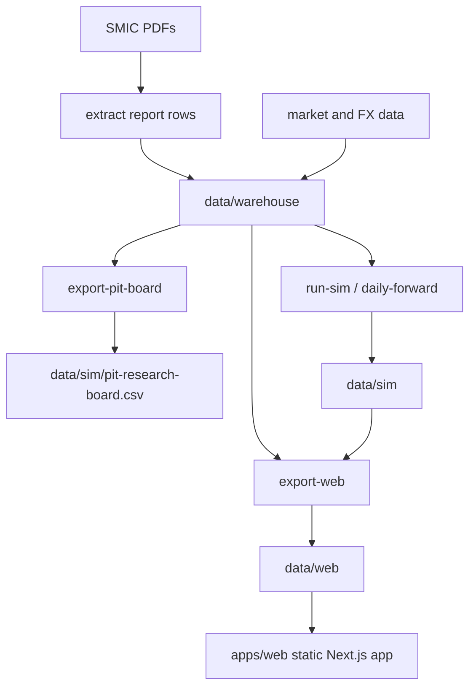

# SNUSMIC Portfolio Lab

SNUSMIC Portfolio Lab turns SMIC research reports into point-in-time datasets, fixed account simulations, and static web artifacts. The current repository does **not** search for strategies or promote generated strategy candidates. Strategy discovery was removed deliberately; the PIT board is exported so a human can inspect the data and design rules explicitly.

[Live site](https://smic-portfolio.vercel.app) · [Changelog](./CHANGELOG.md) · [Design system](./DESIGN.md)

## What This Repo Does

- Collects SMIC report PDFs and extracted report rows.
- Normalizes reports, prices, FX, and benchmark data into `data/warehouse`.
- Exports a point-in-time research board at `data/sim/pit-research-board.csv`.
- Runs fixed benchmark/follower account simulations with real ledger constraints: cash, deposits, integer shares, fees, taxes, trades, holdings, and equity paths.
- Exports deterministic `data/web` JSON/CSV artifacts consumed by the static Next.js app.

## What It Does Not Do

- No broker strategy search.
- No stock-rule search or admission.
- No PIT strategy generation.
- No MTT strategy account_id.
- No `strategy-admission.json` web contract.
- No hidden legacy/fallback strategy path.

## Core Commands

```bash
uv sync --group dev
pnpm --dir apps/web install
```

Refresh data and static artifacts:

```bash
bash scripts/refresh_web_artifacts.sh
```

Full rebuild:

```bash
bash scripts/full_rebuild_web_artifacts.sh
```

Manual PIT dataset export:

```bash
python -m snusmic_pipeline export-pit-board \
  --warehouse data/warehouse \
  --out data/sim/pit-research-board.csv \
  --start 2021-01-04 \
  --cadence M
```

Fixed account simulation:

```bash
python -m snusmic_pipeline run-sim \
  --warehouse data/warehouse \
  --out data/sim
```

Web artifact export:

```bash
python -m snusmic_pipeline export-web \
  --warehouse data/warehouse \
  --sim data/sim \
  --out data/web
```

## Default Simulation Set

The default simulation config contains fixed baselines only:

- All Weather
- QQQ
- SPY
- KODEX 200
- GLD
- SMIC Report Follower
- SMIC Report Follower with Stops
- Weak Oracle diagnostic baseline

`weak_oracle` is a diagnostic upper bound in the default full simulation config. It is not a tradable strategy and `daily-forward` excludes it from checkpointed core operation.

## Data Flow



## Documentation

| Document | Purpose |
| --- | --- |
| [docs/product-spec.md](./docs/product-spec.md) | Product intent and priorities |
| [docs/backtest-contract.md](./docs/backtest-contract.md) | Account, PIT, and no-lookahead contract |
| [docs/technical-architecture.md](./docs/technical-architecture.md) | Pipeline, artifact, and route map |
| [docs/agent-playbook.md](./docs/agent-playbook.md) | Agent working rules |
| [docs/testing-performance-strategy.md](./docs/testing-performance-strategy.md) | Test and performance scope |
| [DESIGN.md](./DESIGN.md) | UI design system |

## Web App

The web app is a static reader over committed artifacts. It must not call live market APIs or reconstruct simulation logic in the browser.

Main routes:

- `/`
- `/main`
- `/portfolio`
- `/portfolio/[strategy]`
- `/reports`
- `/reports/[symbol]`
- `/reports/[symbol]/[reportId]`
- `/screener`
- `/statistics`

## Validation

```bash
uv run ruff check src tests scripts
uv run pytest -q -m "not slow" -x
pnpm --dir apps/web artifact:check
pnpm --dir apps/web typecheck
pnpm --dir apps/web exec biome check .
pnpm --dir apps/web build
```

## Project Layout

```text
apps/web/                  Static Next.js app
data/warehouse/            Normalized report, price, FX, and benchmark inputs
data/sim/                  Simulation outputs and PIT research board
data/web/                  Canonical static web artifacts
docs/                      Product, architecture, testing, and agent docs
scripts/                   Operational rebuild/refresh helpers
src/snusmic_pipeline/      Python package and CLI
tests/                     Pytest suite
```

## Current Contract

This repo is now intentionally PIT-first:

1. Build trustworthy point-in-time data.
2. Keep fixed baseline simulations for context.
3. Let strategy design happen explicitly, outside the pipeline, until buy/sell/sizing/rebalance rules are clearly declared.
