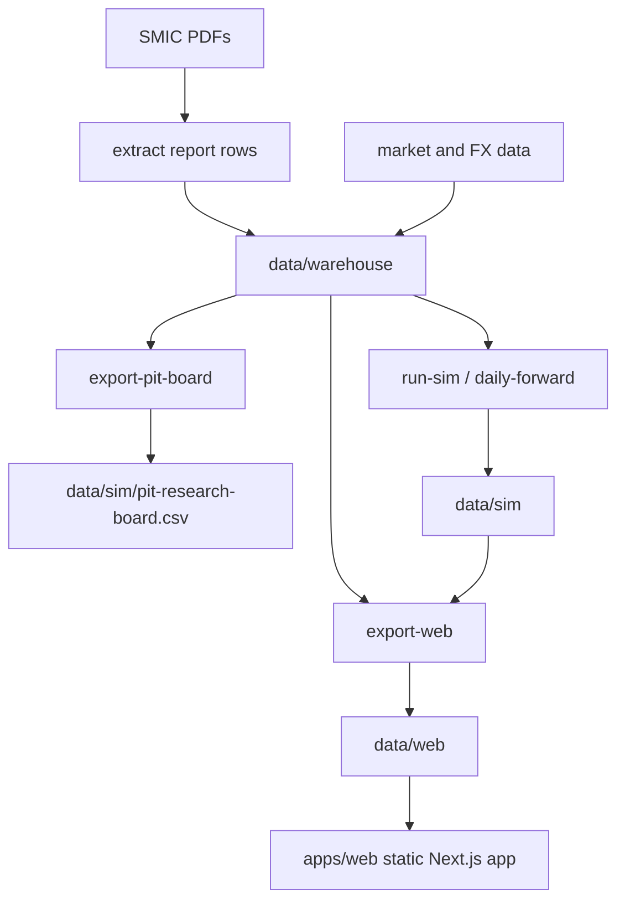

# SNUSMIC Portfolio Lab

SNUSMIC Portfolio Lab은 SMIC 리서치 리포트를 point-in-time(PIT) 데이터셋, 계좌 시뮬레이션, 정적 웹 아티팩트로 변환하는 프로젝트입니다. 현재 릴리스는 PIT 전략 리서치 스프린트를 마무리했고, 큰 포트폴리오 시계열은 선별 계좌별 shard로 나누어 웹 배포 payload를 작게 유지합니다.

[English README](./README.en.md) - [Live site](https://smic-portfolio.vercel.app) - [Changelog](./CHANGELOG.md) - [Design system](./DESIGN.md)

### 이 저장소가 하는 일

- SMIC 리포트 PDF와 추출된 리포트 행을 수집합니다.
- 리포트, 가격, FX, 벤치마크 데이터를 `data/warehouse`의 PIT warehouse로 정규화합니다.
- `data/sim/pit-research-board.csv`에 point-in-time 리서치 보드를 내보냅니다.
- 현금, 적립금, 정수 주식 수량, 수수료, 세금, 거래, 보유, equity path를 포함한 벤치마크/팔로워/선별 PIT 계좌 시뮬레이션을 실행합니다.
- 정적 Next.js 앱이 읽는 결정론적 `data/web` JSON/CSV 아티팩트를 생성하고, 큰 portfolio equity 및 daily decision 시계열은 계좌별 shard로 나눕니다.
- 원시 artifact table 대신 page-shaped frontend view model로 리포트 검증, 통계, 계좌 화면을 제공합니다.
- 선별 PIT/follower 계좌 곡선을 벤치마크와 함께 보여주고, chart UI에서 trade marker와 benchmark line을 제어합니다.

### 하지 않는 일

- 실시간 브로커 연동이나 주문 제출을 하지 않습니다.
- 웹 앱에서 실시간 market data를 가져오지 않습니다.
- PIT 계좌 시뮬레이션에서 미래 정보를 쓰지 않습니다.
- 생성된 모든 리서치 branch를 자동으로 product UI에 올리지 않습니다.

### 핵심 명령

이 저장소는 shell script 대신 Python/Node entrypoint를 사용해 macOS, Windows, CI에서 같은 명령을 실행합니다.

```bash
uv sync --locked --group dev
pnpm --dir apps/web install --frozen-lockfile --prefer-offline
```

데이터와 정적 artifact 갱신:

```bash
uv run --locked python -m snusmic_pipeline refresh-web-artifacts
```

전체 재생성:

```bash
uv run --locked python -m snusmic_pipeline rebuild-web-artifacts
```

수동 PIT dataset export:

```bash
uv run --locked python -m snusmic_pipeline export-pit-board --warehouse data/warehouse --out data/sim/pit-research-board.csv --start 2021-01-04 --cadence M
```

고정 계좌 시뮬레이션:

```bash
uv run --locked python -m snusmic_pipeline run-sim --warehouse data/warehouse --out data/sim
```

웹 artifact export:

```bash
uv run --locked python -m snusmic_pipeline export-web --warehouse data/warehouse --sim data/sim --out data/web
```

### 선별 포트폴리오

생성된 artifact에는 많은 리서치 branch가 들어갈 수 있지만, `/portfolio`는 대표 shortlist만 보여줍니다.

| 표시 이름 | 의미 |
| --- | --- |
| Partial 75 | 현재 local-return 후보. Quarterly Top5 PIT trend 계좌이며 winner를 보유하고, 관측된 보유 기간 고점에서 25% 되돌림이 발생하면 20% account weight 쪽으로 trim하고, 현금이 equity의 12.5% 이상일 때 eligible cash의 75%만 재배치합니다. |
| CashGate 12.5 | Partial 75의 robustness baseline. 같은 retained-winner/trailing-trim 구조를 쓰되, cash가 12.5% gate에 도달할 때만 재배치합니다. |
| TrailTrim 20 | 더 단순한 profit-protection baseline. PIT trend shell을 유지하고 cash redeploy branch 없이 집중 winner를 20% cap 쪽으로 trim합니다. |
| Trend Top5 | 단순 point-in-time trend-score Top5 계좌입니다. 낮은 복잡도의 기준점으로 씁니다. |
| Score Top5 | 단순 point-in-time score Top5 계좌입니다. trend 구성이 실제로 가치를 더하는지 확인하는 기준입니다. |
| SMIC Follower | 실제 리포트 기반 계좌 행동을 추적하는 report-follower baseline입니다. |

All Weather, KODEX 200, QQQ, SPY, GLD는 비교 벤치마크로 유지합니다. Forward-looking oracle simulation은 진단용이며 product account가 아닙니다.

### 데이터 흐름



### 문서

| 문서 | 목적 |
| --- | --- |
| [docs/product-spec.md](./docs/product-spec.md) / [EN](./docs/product-spec.en.md) | 제품 의도와 우선순위 |
| [docs/data-artifact-policy.md](./docs/data-artifact-policy.md) / [EN](./docs/data-artifact-policy.en.md) | 커밋되는 데이터의 소유권과 생성 캐시 정책 |
| [docs/backtest-contract.md](./docs/backtest-contract.md) / [EN](./docs/backtest-contract.en.md) | 계좌, PIT, no-lookahead 계약 |
| [docs/technical-architecture.md](./docs/technical-architecture.md) / [EN](./docs/technical-architecture.en.md) | pipeline, artifact, route map |
| [DESIGN.md](./DESIGN.md) | UI design system |

### 웹 앱

웹 앱은 커밋된 artifact를 읽는 정적 reader입니다. live market API를 호출하거나 browser에서 시뮬레이션 logic을 재구성하면 안 됩니다.

주요 route:

- `/`
- `/portfolio`
- `/portfolio/[account]`
- `/portfolio/[account]/equity`
- `/portfolio/[account]/holdings`
- `/portfolio/[account]/trades`
- `/reports`
- `/reports/[symbol]/[reportId]`
- `/calendar`
- `/statistics`

### 검증

```bash
uv run --locked ruff check src tests scripts
uv run --locked pytest -q -m "not slow" -x
pnpm --dir apps/web artifact:check
pnpm --dir apps/web typecheck
pnpm --dir apps/web exec biome check .
pnpm --dir apps/web build
pnpm --dir apps/web smoke:static
```

`tests/test_web_artifacts.py`는 release-gate contract suite입니다. full web export를 수행하므로 기본 edit-test loop로 쓰지 않습니다.

배포 build도 cross-platform입니다.

```bash
pnpm build
node scripts/prepare_vercel_prebuilt.mjs
```

### 프로젝트 구조

```text
apps/web/                  정적 Next.js 앱
data/warehouse/            정규화된 report, price, FX, benchmark input
data/sim/                  simulation output과 PIT research board
data/web/                  canonical static web artifact, portfolio series는 선별 계좌별 shard
docs/                      제품, 아키텍처, 테스트, agent 문서
scripts/                   운영용 rebuild/refresh helper
src/snusmic_pipeline/      Python package와 CLI
tests/                     Pytest suite
```

### 현재 계약

이 저장소는 PIT-first입니다.

1. 신뢰할 수 있는 point-in-time data를 만듭니다.
2. benchmark/follower simulation은 context로 유지합니다.
3. 새 계좌를 promotion하기 전에 전략 idea, result, retrospective를 Markdown으로 기록합니다.
4. parameter search output이 investable truth처럼 보이지 않도록 product UI에는 선별 shortlist만 보여줍니다.

### 데이터 아티팩트 주의

이 저장소는 정적 웹 배포를 재현하기 위해 일부 데이터 아티팩트를 의도적으로 커밋합니다. 특히 `data/warehouse/daily_prices.csv`는 약 67MB로 clone 크기에 영향을 줍니다. 어떤 데이터가 source-of-truth이고 어떤 파일이 재생성 가능한 cache인지에 대한 기준은 [docs/data-artifact-policy.md](./docs/data-artifact-policy.md)를 따릅니다.
