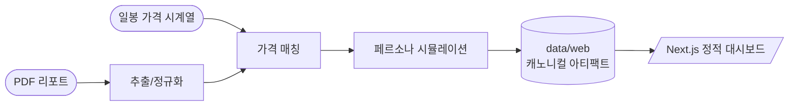
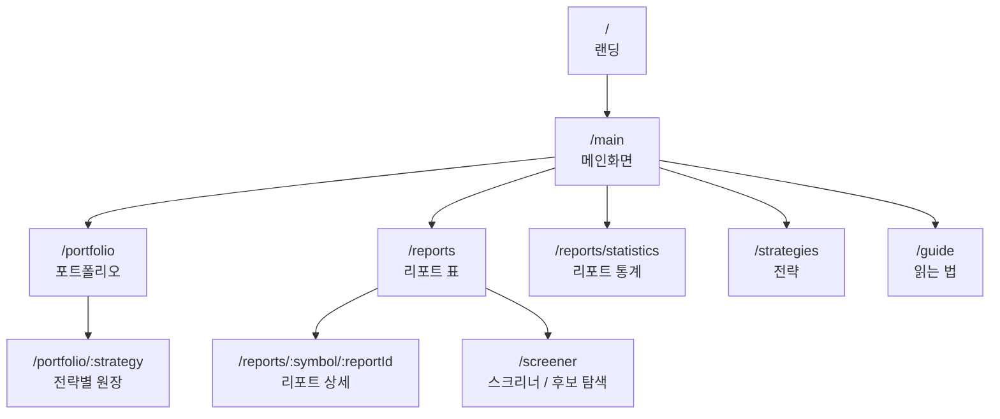
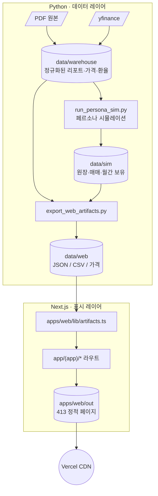

<div align="center">

# SNUSMIC Portfolio Lab

서울대 SMIC 학회의 리서치 리포트 · 가격 데이터 · 포트폴리오 시뮬레이션 · 전략 검증을
한 화면에서 같은 기준으로 추적하는 **읽기 전용 정적 리서치 대시보드**

[](./CHANGELOG.md)
[](https://nextjs.org/)
[](https://www.python.org/)
[](https://tailwindcss.com/)
[](https://vercel.com/)
[](#)

[**라이브 →**](https://smic-portfolio.vercel.app) · [**변경 이력 →**](./CHANGELOG.md) · [**디자인 시스템 →**](./DESIGN.md)

</div>

---

## TL;DR

> **리포트 추천이 실제 가격 경로에서 어떤 결과로 이어졌는가**를 표 중심으로 추적합니다.
> 카드 벽 없이, 스크리너처럼 모든 화면을 정렬·필터·연산자 표로 통일했습니다.



## 핵심 기능

| 영역 | 무엇을 보여주나 |
|---|---|
| **리포트 검증** | 발간가 → 목표가 약속이 실제 가격 경로에서 어디까지 도달했는가, 도중 최대 손실, 현재 수익률 |
| **포트폴리오 원장** | share-based 보유 종목, 평가액 트리맵(±25% 연속 색), 매매내역, 현금 비중 |
| **전략 비교** | 벤치마크 vs 고유 전략, MDD ≤ 15% 가드를 통과한 전략만 강조 |
| **후보 탐색** | 스크리너 — 컬럼별 연산자 필터(`>=100`, `<=-10`, `>=2025-01-01`), 프리셋 10종, j/k 키보드 이동 |
| **리포트 통계** | 도달률·중앙값·경로 분포·익절선 검정을 한 페이지에서 |
| **명령 팔레트** | `⌘K` / `Ctrl+K` — 페이지·전략·종목 한 곳에서 점프 |

## 화면 구조



## 데이터 파이프라인



각 화면은 `data/web/*` 캐노니컬 아티팩트만 읽습니다. 필수 아티팩트가 빠지면 빌드가 즉시 실패합니다.

## 키보드 단축키

| 키 | 동작 |
|---|---|
| `⌘K` / `Ctrl+K` | 명령 팔레트 (페이지 + 전략 + 종목 검색) |
| `/` | 스크리너·리포트 표 검색 입력 포커스 |
| `Esc` | 검색 비우기 / 드로어 닫기 |
| `j` / `k` | 리포트 표 행 이동 |
| `Enter` | 활성 행 상세 페이지 진입 |

## 접근성

| 항목 | 적용 |
|---|---|
| Skip link | `본문으로 건너뛰기` — 모든 페이지 첫 포커스 |
| 모바일 드로어 | 포커스 트랩 + Esc 닫기 + 이전 포커스 복원 |
| 정렬 헤더 | `aria-sort="ascending/descending/none"` |
| 필터 변경 | `aria-live="polite"`로 결과 수 안내 |
| 트리맵 | Canvas 옆 `sr-only` 보유 종목 리스트 (종목·평가액·비중·미실현) |
| 색 대비 | `--faint` `#6a7480` (AA 4.7:1), focus outline `--accent-strong` |
| 모션 | `prefers-reduced-motion`에서 transition 완전 차단 |

## 빠른 시작

```bash
# 1) Python 워크스페이스 (uv 사용)
uv sync --group dev

# 2) 웹 의존성
pnpm --dir apps/web install

# 3) 아티팩트 일괄 갱신 (가격 + 시뮬 + JSON 내보내기)
bash scripts/refresh_web_artifacts.sh

# 4) 개발 서버
pnpm --dir apps/web dev
# → http://localhost:3000
```

### 운영 명령

```bash
# 타입체크 + 린트 + 정적 빌드
pnpm --dir apps/web typecheck
pnpm --dir apps/web lint
pnpm --dir apps/web build

# 아티팩트 스키마 검증
pnpm --dir apps/web artifact:check

# Python 테스트
uv run pytest
```

## 기술 스택

| 영역 | 도구 |
|---|---|
| **언어** | TypeScript 5, Python 3.13 |
| **프레임워크** | Next.js 16 App Router, Tailwind CSS v4 |
| **차트** | TradingView lightweight-charts, d3-hierarchy 트리맵 |
| **테이블** | TanStack Table v8 (정렬·필터링·컬럼 가시성) |
| **상태** | useReducer + 판별 액션 (스크리너 필터) |
| **데이터** | DuckDB, pandas, yfinance, pdfplumber |
| **품질** | tsc, biome, ruff, pytest, pre-commit |
| **배포** | Vercel 정적 export — 413 페이지 prebuild |

## 디렉토리

```text
.
├── apps/web/                       # Next.js 정적 대시보드
│   ├── app/                         # App Router 라우트 (Landing + (app))
│   ├── components/
│   │   ├── charts/                  # lightweight-charts 패널
│   │   ├── reports/                 # 리포트 표/상세 슬림 뷰
│   │   ├── screener/                # 스크리너 표 (useReducer)
│   │   ├── trading/                 # 포트폴리오·트리맵·매매
│   │   └── ui/                      # AppShell, CommandPalette, NativeSelect …
│   └── lib/                         # artifacts 리더, 포맷, 뷰 모델
├── data/
│   ├── warehouse/                   # 정규화된 리포트·가격·환율 (DuckDB)
│   ├── sim/                         # share-based 시뮬레이션 산출물
│   ├── web/                         # 정적 사이트 캐노니컬 JSON/CSV
│   ├── markdown/                    # 추출된 리포트 본문
│   ├── pdfs/                        # 원본 PDF
│   └── prices/                      # 일봉 시계열
├── src/snusmic_pipeline/            # 시뮬레이션 + 웹 아티팩트 내보내기
├── scripts/
│   ├── refresh_web_artifacts.sh
│   ├── run_persona_sim.py
│   └── export_web_artifacts.py
├── tests/                           # pytest 스위트
├── docs/                            # 설계·결정·UI 원칙
├── DESIGN.md                        # 디자인 시스템 명세
└── CHANGELOG.md                     # 릴리스 노트
```

## 벤치마크와 고유 전략

벤치마크는 비교 기준선, 고유 전략은 사용자가 검토하는 원장형 전략입니다.

**벤치마크 세트**

1. All-Weather
2. SMIC Follower v1
3. SMIC Follower v2 / SL
4. KODEX 200 (`069500.KS`)
5. QQQ
6. SPY
7. GLD
8. Weak Prophet (미래정보 상한선)

**고유 전략 통과 조건**

```text
MDD ≤ 15% AND return > KOSPI/KODEX 200 benchmark
```

수익률이 높아도 MDD가 15%를 넘으면 통과로 표시하지 않습니다. MDD는 음수가 아니라 **양수 손실폭**입니다.

## 원칙

| | 원칙 | 함의 |
|---|---|---|
| 1 | **데이터가 진실** | 모든 페이지는 `data/web/*` 아티팩트만 읽음. 하드코딩된 심볼/페르소나 금지 |
| 2 | **빠른 실패** | 필수 아티팩트 누락 → 빌드 실패. 누락된 가격 → 종목 제외 |
| 3 | **표 우선** | 모든 화면은 같은 표 컬럼/정렬/필터 프리셋만 바꿔서 본다 |
| 4 | **읽기 전용** | 실시간 매매·체결 X. 모든 화면은 스냅샷 기준 |
| 5 | **키보드 우선** | 분석가가 마우스 없이 일할 수 있어야 한다 |
| 6 | **접근성은 옵션 아님** | WCAG 2.2 AA. 스크린리더·키보드·저시력 모두 1급 사용자 |

## 최근 릴리스

| 태그 | 핵심 |
|---|---|
| **`v0.21.4-slim-report-detail.1`** | 리포트 상세 표 중심 슬림화, sparkline 클램프 제거, 사이드바 활성 텍스트 흰색 보장, 문서 한국어화 |
| `v0.21.3-ultragoal-polish.1` | 모바일 포커스 트랩, 명령 팔레트 확장(전략+종목), 스크리너 useReducer + COLUMN_META, 트리맵 연속 색 |
| `v0.21.2-command-palette.1` | ⌘K 명령 팔레트, 퀀타일 1회 정렬, PageHero 표준화 |
| `v0.21.1-mobile-and-polish.1` | 모바일 햄버거 드로어, 사이드바 활성 강조, 제네릭 Select |
| `v0.21.0-product-density-i18n.1` | 컬럼 헤더 한국어화, j/k 행 이동, badge CSS 정의, route error 핸들러 |
| `v0.20.4-ui-density-a11y.1` | globals.css 정리, skip-link, loading.tsx, not-found.tsx |

전체 이력은 [`CHANGELOG.md`](./CHANGELOG.md) 참고.

## 라이선스 & 사용

이 저장소는 SMIC 학회 내부 리서치 검증 용도입니다. PDF 원본의 저작권은 각 발간 기관에 있습니다. 외부 PR은 받지 않습니다.
