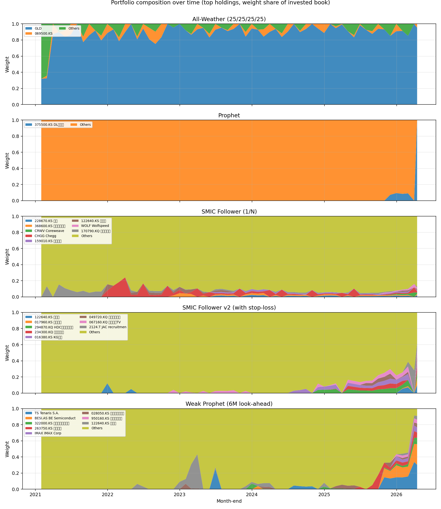

# SNUSMIC Quant Simulation

서울대 SMIC(서울대학교 학생 투자 동아리, [snusmic.com](https://www.snusmic.com)) 리서치 PDF를 수집·파싱해 추출한 **목표가/티커/발간일 데이터**와, yfinance에서 받은 **KRW 환산 일봉 가격**을 결합해, 다양한 투자자 페르소나의 **계좌 단위 누적 수익률**을 재현하는 Python/data 저장소입니다.

> "예언자처럼 미래를 알고 사면 얼마, 추종자처럼 사라는대로만 사면 얼마, 1억 적금 + 월 100만원으로 5년 굴리면 얼마인지" 를 한 번에 보여줍니다.

이 저장소는 데이터 + 시뮬레이션 코드만 남긴 **server-simulation-first** 구조입니다. 프론트엔드(Vercel, GitHub Pages, Next.js)는 모두 제거되었고, 모든 결과물은 `data/` 디렉토리의 CSV/JSON과 PNG 차트입니다.

---

## 목차

1. [핵심 결과](#1-핵심-결과)
2. [무엇을 재현하나요?](#2-무엇을-재현하나요)
3. [페르소나 시뮬레이션](#3-페르소나-시뮬레이션)
4. [현실적 수익률 계산 — share-based 증권 원장](#4-현실적-수익률-계산--share-based-증권-원장)
5. [적립식 시나리오 (1천만 + 월 100만 + 2년마다 +50만)](#5-적립식-시나리오-1천만--월-100만--2년마다-50만)
6. [데이터 설계 (SSOT/SDD/TDD)](#6-데이터-설계-ssotsddtdd)
7. [저장소 구조](#7-저장소-구조)
8. [실행 방법](#8-실행-방법)
9. [산출물](#9-산출물)
10. [검증 / CI](#10-검증--ci)
11. [참고 문서](#11-참고-문서)

---

## 1. 핵심 결과

기간: **2021-01-04 → 2026-04-15** (약 5년 3개월, 영업일 1,313일)
저축 시나리오: **초기 1천만 + 월 100만 (2년마다 +50만 에스컬레이션) → 누적 1억 적립**
유니버스: SMIC 리서치 리포트 **216개, 종목 202개** (KRX/KOSDAQ/해외 ETF 포함, 모두 KRW 환산)

### SMIC 리서치 베이스라인 (페르소나 무관)

페르소나 결과를 보기 전에, SMIC가 발간한 리포트 자체의 사후 통계 — 모든 페르소나의 공통 출발점입니다 (시뮬 윈도우 안에 가격이 매칭된 206개 리포트 기준).

| 지표 | 값 |
|---|---:|
| 총 리포트 수 | **211개** (가격 매칭 206개) |
| 목표가 도달률 | **50.5%** (104/206) |
| 목표가 도달까지 (평균 / 중앙값) | 343일 / 168일 |
| 발간 시점 약속한 목표 상승률 (평균) | **+185.1%** |
| 발간 후 누적 수익률 (평균 / 중앙값) | **+80.5%** / +21.3% |
| 목표가 대비 현재 갭 (평균) | −55.6% |

> 약속한 +185% 중 절반(50.5%)만 실제 도달. 그러나 모집단 평균 누적 수익률이 **+80%** 라 → 분포 자체가 손실보다 이익이 큰 right-skew. 모든 페르소나가 +수익으로 끝나는 근본 원인이 여기에 있고, 페르소나 차이는 "이 분포에서 도달 예정인 winner 만 골라잡을 수 있느냐(예언자) vs 분포 전체를 1/N 으로 받아안느냐(추종자)" 의 차이로 좁혀집니다. 자세한 Top 5 winner/loser와 종목별 풀 데이터는 §9-0 / `data/sim/report_stats.json` + `report_performance.csv`.

### 페르소나 결과

| 페르소나 | 최종 평가금 | 누적 적립 | 순이익 | IRR (현금흐름 가중) | 최대 낙폭 | 거래 수 |
|---|---:|---:|---:|---:|---:|---:|
| **Prophet** (SMIC-Constrained) | 20,141.51M | 1억 | **+20,041.51M** | **274.37%** | 39.4% | 528 |
| **Weak Prophet** (6M max-Sharpe) | 3,215.61M | 1억 | +3,115.61M | 154.22% | 27.4% | 1,237 |
| **All-Weather** (벤치마크) | 211.61M | 1억 | +111.61M | 29.39% | 9.4% | 244 |
| **SMIC Follower v2** (손절 추가) | 186.56M | 1억 | +86.56M | 24.43% | 22.4% | 2,034 |
| **SMIC Follower** (1/N 충신) | 172.40M | 1억 | +72.40M | 21.33% | 15.2% | 4,283 |

> Prophet은 **SMIC-Constrained 디자인**: 자유 종목 선택 대신 SMIC 리포트 풀 안에서만 매수, 단 어떤 리포트가 다음 6개월 내 목표가에 도달할지 미리 알고 그 리포트들만 동일가중. 자연스럽게 Universe 의 깊이만큼만 사이즈가 잡혀 158억주 같은 비현실적 매수가 없음 (이전 free-form Top-K Prophet의 757 quadrillion 문제 해결).
>
> 결과적으로 Prophet ≈ Weak Prophet × 6 배 정도의 합리적인 상한선. SMIC 리서치가 그래도 쓸 만하다면 (목표가 hit 률 50%+), 진입 타이밍을 미리 알기만 해도 6배 알파를 낼 수 있다는 뜻.
>
> Raw OHLC (auto_adjust=False) 기준이라 배당 재투자가 빠져 있어 모든 페르소나가 약간 보수적입니다.


### 시점별 포트폴리오 변화

각 페르소나의 월말 보유 비중 변화를 한 차트에 묶어서 표시. 페르소나마다 어떤 종목을 얼마나 들고 있다 회전했는지 한 눈에 보입니다.



### 현재 보유 종목 (마지막 영업일 기준 top 5)

#### Prophet (총 1종목, 평가금 합 20,141.46M KRW)

| symbol | 회사 | 수량 | 평단 | 종가 | 평가금(M) | 평가손익 |
|---|---|---:|---:|---:|---:|---:|
| 375500.KS | DL이앤씨 | 196,502 | 59,414 | 102,500 | 20,141.46 | +73.0% |

> 마지막 리밸런스(2026-04-01)에서 SMIC 리포트 중 다음 6개월 안에 목표가에 도달할 종목이 DL이앤씨 단 1건이라 전액 집중. 진입가 59,414 → 종가 102,500 → 미실현 +73%. 시뮬 끝까지 holding 후 다음 리밸런스에서 자동 회전.

#### Weak Prophet (총 22종목, 평가금 합 3,189.3M KRW)

| symbol | 회사 | 수량 | 평단 | 종가 | 평가금(M) | 평가손익 |
|---|---|---:|---:|---:|---:|---:|
| NE | Noble Corporation PLC | 6,419 | 41,850 | 69,680 | 447.3 | +66.0% |
| TS | Tenaris S.A. | 4,305 | 52,620 | 85,065 | 366.2 | +62.0% |
| 353810.KQ | 이지바이오 | 43,827 | 5,823 | 8,020 | 351.5 | +38.0% |
| 278470.KS | 에이피알 | 825 | 181,869 | 413,000 | 340.7 | +127.0% |
| STNG | Scorpio Tankers Inc. | 2,946 | 75,769 | 108,678 | 320.2 | +43.0% |

#### All-Weather (총 4종목, 평가금 합 211.6M KRW)

| symbol | 회사 | 수량 | 평단 | 종가 | 평가금(M) | 평가손익 |
|---|---|---:|---:|---:|---:|---:|
| 069500.KS | KOSPI 200 ETF | 610 | 39,097 | 92,665 | 56.5 | +137.0% |
| QQQ | NASDAQ-100 ETF | 57 | 588,784 | 936,608 | 53.4 | +59.0% |
| SPY | S&P 500 ETF | 51 | 705,512 | 1,028,506 | 52.5 | +46.0% |
| GLD | Gold ETF | 76 | 276,484 | 647,221 | 49.2 | +134.0% |

#### SMIC Follower v2 (총 17종목, 평가금 합 186.3M KRW)

| symbol | 회사 | 수량 | 평단 | 종가 | 평가금(M) | 평가손익 |
|---|---|---:|---:|---:|---:|---:|
| 122640.KS | 예스티 | 513 | 20,413 | 29,200 | 15.0 | +43.0% |
| 017960.KS | 한국카본 | 254 | 41,177 | 51,100 | 13.0 | +24.0% |
| 000150.KS | 두산 | 9 | 1,113,724 | 1,358,000 | 12.2 | +22.0% |
| 294870.KQ | HDC현대산업개발 | 489 | 21,414 | 23,500 | 11.5 | +10.0% |
| 234300.KQ | 에스트래픽 | 3,112 | 3,367 | 3,590 | 11.2 | +7.0% |

#### SMIC Follower (1/N) (총 100종목, 평가금 합 168.9M KRW)

| symbol | 회사 | 수량 | 평단 | 종가 | 평가금(M) | 평가손익 |
|---|---|---:|---:|---:|---:|---:|
| 228670.KS | 레이 | 300 | 5,263 | 10,720 | 3.2 | +104.0% |
| 368600.KS | 아이씨에이치 | 1,770 | 893 | 1,468 | 2.6 | +64.0% |
| CRWV | Coreweave | 14 | 120,493 | 174,405 | 2.4 | +45.0% |
| CHGG | Chegg | 1,461 | 1,045 | 1,602 | 2.3 | +53.0% |
| 159010.KS | 아스플로 | 285 | 5,544 | 7,990 | 2.3 | +44.0% |

전체 보유 종목은 `data/sim/current_holdings.csv`, 시점별 변화는 `data/sim/monthly_holdings.csv` 에 들어있습니다.

> 모든 평가금/순이익은 **share-based** 회계 — 정수 주식 + 가중평균원가 + 매수 0.015% 수수료 + 매도 0.18% 거래세 + 0.05% 슬리피지가 모든 체결에 적용된 결과입니다. 증권사 앱에서 보는 숫자와 같은 의미를 갖습니다.
>
> equity curve / net profit 차트는 **% 수익률 기준** — 누적 적립금 대비 평가금 비율 (`equity / cumulative_deposits − 1`) 입니다. 같은 1억을 적립한 가상의 투자자 5명을 비교한다는 의미. equity curve의 Y축은 **로그 스케일** (눈금 라벨은 `+0% / +100% / +1,000% / +10,000%` 형태)이라 직선의 기울기가 곧 CAGR이고 Prophet의 184× outcome 이 mid-tier 페르소나의 +30~+150% 영역을 가리지 않습니다. 마크-투-마켓은 종목 close가 결측되는 휴장/거래정지일에도 직전 close를 forward-fill (`board.asof`) 해서, 기존에 있던 가짜 −30% 스파이크를 제거했습니다.

핵심 관찰:

- **예언자 vs 약한 예언자**: 풀 룩어헤드(IRR 274%)와 6개월 max-Sharpe(IRR 154%)의 차이는 +120%p — 진입 타이밍을 알기만 해도 분산형 max-Sharpe보다 Net profit 약 6배 더 깊이 굴릴 여지가 있다는 뜻. 둘 다 본질적으로 lookahead-bias 가 있는 상한선.
- **충신 vs 충신 v2**: 손절 룰 3종이 들어가면 IRR 21.3% → 24.4% 로 +3pp 좋아지지만 MDD 도 15.2% → 22.4% 로 함께 늘어납니다. 손절 자체가 일시적으로 큰 낙폭을 실현으로 굳혀버리는 부작용 — *'손절은 위험을 줄인다'* 의 통념과 반대 방향으로, 이 데이터에서는 손절 도입이 손익은 약간 끌어올리되 회복-가능 손실까지 잘라내며 변동성을 키우는 패턴.
- **올웨더 vs 충신 v1**: 단순 4분할 ETF 적립(IRR 29.4% / MDD 9.4%)이 SMIC 1/N 적립(IRR 21.3% / MDD 15.2%)을 IRR·MDD 양쪽 모두에서 이깁니다 — 추종자가 사라는 대로 사면 분산만으로는 글로벌 ETF DCA를 못 따라잡는다는 증거.
- **All-Weather의 MDD가 9.4%로 낮은 이유**: 4자산이 서로 상관관계 0에 가깝고 (금 vs 미국 주식 vs 한국 주식), 매월 비중을 강제로 25/25/25/25 로 되돌리는 mean-reversion 효과 덕분. 단, 리밸런스는 **모든 4개 거래소가 모두 영업하는 날**에만 집행됨 — 한쪽이 휴장이면 다음 영업일로 이연 (예: Thanksgiving 같이 한국은 열리지만 미국이 닫힌 날에 KOSPI 100% 쏠림이 생기지 않도록).
- **현금 배당 반영**: 모든 페르소나가 이제 ex-date에 보유 수량 × 주당배당금을 KRW로 환산해 cash 로 받고 (15% 원천징수 차감), 다음 리밸런스에서 자동 재투자됩니다. 발간 시점 가격은 여전히 raw OHLC (분할 미보정) 라 SMIC 보고서의 목표가 단위와 직접 비교 가능하면서도 보유 기간의 배당 yield 는 손실 없이 잡힙니다. 실효 yield 영향은 페르소나별 보유 회전율에 비례 — 1/N 충신처럼 길게 들고 있는 페르소나가 IRR 을 가장 크게 끌어올렸습니다 (12.9% → 21.3%).

---

## 2. 무엇을 재현하나요?

### 2-1. PDF 리서치 수집·추출 파이프라인

```
SNUSMIC 사이트 인덱스 → 218개 PDF 다운로드 → opendataloader-pdf로 OCR/텍스트 추출
        ↓
data/extracted_reports.csv  (리포트명, 종목명, 발간일, 목표가 Bear/Base/Bull, 티커, 거래소)
        ↓
yfinance로 종목별 일봉 다운로드 + 환율 변환 (USD/JPY/HKD/CNY → KRW)
        ↓
data/warehouse/daily_prices.csv  (전 종목 KRW 환산 OHLCV)
        ↓
data/warehouse/reports.csv       (목표가도 모두 KRW 환산)
```

이 데이터 자체가 한국어 리서치 PDF에서 정량 데이터를 끌어내는 **재현 가능한 추출 컨트랙트**의 산출물입니다. 추출 품질은 `data/extraction_quality.json` 으로 추적됩니다.

### 2-2. 시뮬레이션 모듈

`snusmic_pipeline.sim` 이 이 저장소의 유일한 시뮬레이션 표면입니다 — share-based
증권 원장(정수 주식, 현금 원장, 수수료/세금 차감)으로 5개 페르소나를 동일한
`data/warehouse/` CSV 위에서 굴립니다.

---

## 3. 페르소나 시뮬레이션

5개 페르소나(+1 벤치마크)가 동일한 적립 스케줄과 동일한 KRW 가격판을 입력 받아, 서로 다른 매수/매도 정책으로 운용됩니다.

### 3-1. `oracle` — Prophet (SMIC-Constrained 미래 도달 oracle)

자유 종목 선택 대신 **SMIC 리포트 풀에 한정**된 페르소나. 단, "어떤 리포트가 다음 N개월 내 목표가에 도달할지" 를 미리 알고 그것만 매수합니다.

매월 첫 영업일 알고리즘:

1. 발간일이 오늘 이전이고 **오늘까지 목표가 미도달**인 SMIC 리포트들을 모음
2. 각 리포트에 대해 종가가 **다음 `lookahead_months` (기본 6개월) 내** `target_price × target_hit_multiplier` 에 도달할지 미래 가격 데이터로 확인
3. 도달 예정인 리포트들만 모아 **동일가중** 으로 매수
4. 다음 리밸런스에서 갱신 (이미 hit 한 종목은 자동으로 빠짐, 새로 hit 예정인 게 들어옴)

이게 "SMIC 리서치 자체는 신뢰하지만 진입 타이밍만 미리 안다면 얼마나 벌 수 있나?" 라는 질문에 직접 답하는 페르소나입니다. Universe 깊이가 자연스레 천장 — 동시에 hit 예정 리포트가 N개면 1/N 비중 → 158억주 매수 같은 폭발 없음.

### 3-2. `weak_oracle` — Weak Prophet (6개월 룩어헤드)

미래 6개월의 가격 경로만 보는 페르소나. 6개월 lookahead-bias가 있지만 그 외엔 정상.

- 매월 첫 영업일 (또는 quarterly), 활성 SMIC 종목 유니버스에서
- 향후 6개월간의 **실현 일별 수익률**로 평균/공분산 계산
- `scipy.optimize.minimize` (SLSQP) 로 **long-only max-Sharpe 포트폴리오** 풀이 (sum=1, 종목당 캡 `max_weight=0.40`, 무위험금리 3%)
- 결과 비중대로 share book 리밸런스

룩어헤드를 6→12개월로 늘리거나 max-Sharpe를 min-CVaR로 바꾸려면 `WeakProphetConfig` 한 곳만 고치면 됩니다.

### 3-3. `smic_follower` — SMIC Follower v1 (1/N 충신)

> 사라는 대로 사고 무조건 목표가에 도달할거라고 믿는 충신. 그래서 손실을 봐도 매도를 안함.

- **활성 리포트** = 발간일이 오늘 이전이고, 아직 목표가에 도달 안한 리포트
- 매월 첫 영업일 또는 입금 시: 활성 종목 전부에 **1/N 비중 리밸런스** (현금이 남지 않게)
- 일별 검사: 보유 종목의 종가가 `목표가 × target_hit_multiplier` 이상이면 매도, 다음 리밸런스에서 현금 재분배
- **목표가 미도달 종목은 절대 매도하지 않음** — 손실이 -50%여도 보유

### 3-4. `smic_follower_v2` — SMIC Follower v2 (손절 룰 추가)

v1과 동일하지만 **세 가지 손절 게이트**가 추가됨:

| 룰 | 조건 | 기본값 |
|---|---|---|
| `time_loss` | 1년 이상 보유 AND 평가손실 상태 | 365일 |
| `averaged_down_stop` | 물타기(buy_count ≥ 2) AND 평가손실 < -X% | -20% |
| `report_age_stop` | 리포트 발간 후 X일 경과 AND 목표가 미도달 | 730일 (2년) |

손절된 종목은 **새로운 리포트가 다시 나올 때까지** 활성 풀에서 제외됩니다. 동일 종목에 대한 새 리포트는 다시 매수 신호.

### 3-5. `all_weather` — All-Weather 벤치마크

투자자의 다른 선택지: SMIC 리포트와 무관하게 **분산형 ETF 적립**.

| 자산 | yfinance 심볼 | 비중 |
|---|---|---|
| Gold | `GLD` | 25% |
| NASDAQ-100 | `QQQ` | 25% |
| S&P 500 | `SPY` | 25% |
| KOSPI 200 | `069500.KS` | 25% |

- 입금 시 25/25/25/25 비중으로 자동 분배
- 매월 첫 영업일에 가격 변동으로 어긋난 비중을 다시 25%로 리밸런스
- **부분 휴장일 처리**: 한국이 열리지만 미국이 닫힌 날(예: Thanksgiving, July 4)에는 4개 종목 중 일부만 종가가 존재함. 이런 날은 리밸런스/입금-매수를 **다음 4개 거래소 모두 영업하는 날로 이연** — 그 사이 입금된 현금은 cash로 보유. (이연 없이 그날 가용 종목으로만 재정규화하면 KOSPI 100% 쏠림이 발생함.)
- USD ETF는 yfinance 일봉을 USD/KRW 환율로 환산 (`data/warehouse/fx_rates.csv` 캐시)
- **현금 배당**: 각 ETF의 ex-date 마다 보유 주수 × 주당배당금을 KRW 환산해 cash 로 입금 (`data/warehouse/benchmark_dividends.csv` 캐시). 15% 원천징수 차감 후 다음 리밸런스에서 자동 재투자. GLD 는 무배당이라 0건, QQQ/SPY 는 분기, 069500.KS 는 월별 분배.

> **벤치마크의 의미**: SMIC 종목으로 1/N 굴리는 것이 단순한 글로벌 분산 ETF DCA를 이기는지 직접 비교 가능합니다. 위 결과 표에서 보이듯, 현재 SMIC 1/N (충신) 은 All-Weather 를 이기지 못하고 있습니다.

---

## 4. 현실적 수익률 계산 — share-based 증권 원장

가장 중요한 설계 결정은 모든 페르소나가 **공통 share-based 회계**를 쓴다는 것입니다.

### 4-1. 계좌 상태

```
holdings[symbol] = {
    qty:           int,    # 정수 주식 (반올림하지 않음, floor)
    avg_cost_krw:  float,  # 가중평균 원가 (Korean retail 표준)
    total_cost_krw: float, # 보유분의 누적 매수원가 (수수료 포함)
    first_buy_date: date,  # 시간-손절 룰 평가용
    buy_count:    int,     # 물타기 손절 룰 평가용
    realized_pnl_krw: float
}
cash_krw:         float
contributed_krw:  float   # 적립금 누적
realized_pnl_krw: float
```

### 4-2. 매수/매도 mechanics

```python
# 매수 5,000,000원어치 at 100,000원/주
fill_price = mid_price × (1 + slippage_bps/1e4)        # 100,050
affordable_qty = floor(budget / (fill_price × (1 + comm/1e4)))   # 49 주
gross = qty × fill_price                                # 4,902,450
commission = gross × commission_bps/1e4                # 735
cash -= gross + commission                              # 5,000,000 - 4,903,185 = 96,815
avg_cost = (avg_cost × prior_qty + gross + commission) / new_qty
```

```python
# 매도 49주 at 130,000원/주
fill_price = mid_price × (1 - slippage_bps/1e4)        # 129,935
gross = qty × fill_price                                # 6,366,815
commission = gross × commission_bps/1e4
sell_tax = gross × sell_tax_bps/1e4                    # 11,460  (KOSPI/KOSDAQ)
cash += gross - commission - sell_tax                   # +6,354,400
realized_pnl += (gross - commission - sell_tax) - avg_cost × qty
```

### 4-3. 기본 수수료 (변경 가능)

| 항목 | 기본값 | 단위 |
|---|---:|---|
| 매수/매도 수수료 | 1.5 | bps (0.015%) |
| 매도 거래세 | 18.0 | bps (0.18%, KOSPI/KOSDAQ) |
| 슬리피지 | 5.0 | bps (양방향) |
| 배당 원천징수 | 1500.0 | bps (15%, 한국 retail 평균치 — 한국 발행 15.4%, 해외 ETF 미국 treaty 15%) |

### 4-4. 현금 배당

`refresh-prices` (또는 `refresh-dividends`) 가 yfinance 의 ex-date 별 dividend payout 도 함께 받아 `data/warehouse/dividends.csv` 와 `benchmark_dividends.csv` 에 캐시합니다. 시뮬 루프는 매일 다음과 같은 순서로 동작:

1. **ex-date 매칭**: 오늘이 어떤 보유 종목의 ex-date 면 `qty × dps_local × KRW/unit FX` 으로 gross 배당금 계산.
2. **원천징수 차감**: gross × `dividend_withholding_bps / 1e4` 만큼을 세금으로 떼고, 잔액을 cash 에 입금. 트레이드 원장에는 `side="dividend"`, `reason="dividend_cash"` 의 zero-quantity 행으로 기록 (`gross_krw`, `tax_krw` 모두 채워서 audit trail 유지).
3. **재투자**: 입금된 cash 는 다음 입금 / 리밸런스 / 1/N 재분배 트리거에서 자동으로 다시 사용 — 별도 reinvestment 로직 없음, 기존 share-based 원장이 그대로 처리.

발간 시점 가격은 여전히 `auto_adjust=False` 의 raw OHLC 를 사용해 SMIC 보고서가 인용한 단위와 일치 — 분할/배당 back-adjust 가 일으키던 가격 단위 어긋남이 없으면서도 배당 yield 는 ex-date overlay 로 별도 계상.

### 4-5. 리밸런스

`account.rebalance_to_weights({symbol: weight})` 호출 시:

1. 전체 보유 자산을 오늘 종가로 mark-to-market 해서 equity 계산
2. `target_value = equity × weight` 산출
3. **매도 우선**: 보유분이 target보다 큰 종목부터 차분만큼 정수 주식으로 매도 (현금 확보)
4. 그 다음 **매수**: 보유분이 target보다 작은 종목을 가용 현금 한도 내에서 정수 주식 매수

이 순서 덕분에 리밸런스 한 번에 cash가 음수로 가지 않고, 정수 주식의 한계로 ~1주 미만 자투리만 cash로 남습니다.

---

## 5. 적립식 시나리오 (1천만 + 월 100만 + 2년마다 +50만)

`SavingsPlan` 한 모델이 시나리오 전체를 표현합니다.

| 필드 | 기본값 | 의미 |
|---|---:|---|
| `initial_capital_krw` | 10,000,000 | 시뮬 첫 영업일 일시 입금 |
| `monthly_contribution_krw` | 1,000,000 | 매월 첫 영업일 정기 입금 |
| `escalation_step_krw` | 500,000 | 한 번의 에스컬레이션이 더하는 금액 |
| `escalation_period_years` | 2 | 몇 년마다 에스컬레이션할지 |
| `max_escalations` | 10 | 에스컬레이션 누적 횟수 한도 |

기본 설정에서의 적립금 추이:

| 기간 | 월 적립금 |
|---|---:|
| Year 0–1 | 1,000,000 |
| Year 2–3 | 1,500,000 |
| Year 4–5 | 2,000,000 |
| Year 6–7 | 2,500,000 |
| ... | ... |
| Year 20+ (cap) | 6,000,000 |

5년 3개월 시뮬에서 **누적 적립금 = 1억 KRW (정확히 100,000,000)** — 모든 페르소나가 같은 입금 스케줄을 받습니다.

월 첫 영업일 픽: 거래일 리스트에서 (year, month) 그룹의 최소값. 즉, 1월 1일이 휴일이면 1월 2일에 입금.

---

## 6. 데이터 설계 (SSOT/SDD/TDD)

세 가지 원칙이 코드 전반에 박혀 있습니다.

### 6-1. SSOT — Single Source of Truth

`src/snusmic_pipeline/sim/contracts.py` 가 **전체 시뮬레이션의 데이터 컨트랙트**를 가진 유일한 파일입니다. 모든 모델은:

- `pydantic.BaseModel` v2
- `ConfigDict(frozen=True, extra="forbid", validate_assignment=True)`
- `Annotated[..., Field(ge=..., le=...)]` 로 타입 + 범위 제약

```python
class SavingsPlan(_FrozenModel):
    initial_capital_krw:       Annotated[float, Field(ge=0)] = 10_000_000.0
    monthly_contribution_krw:  Annotated[float, Field(ge=0)] = 1_000_000.0
    escalation_step_krw:       Annotated[float, Field(ge=0)] = 500_000.0
    escalation_period_years:   Annotated[int, Field(ge=1, le=10)] = 2
    max_escalations:           Annotated[int, Field(ge=0, le=20)] = 10
```

새 파라미터 추가 = 모델 한 곳 수정. 시뮬 러너는 `SimulationConfig` 만 읽고 어떤 글로벌 상수도 참조하지 않습니다.

전체 컨트랙트 등록부:

| 모델 | 용도 |
|---|---|
| `SavingsPlan` | 적립금 + 에스컬레이션 |
| `BrokerageFees` | 수수료/세금/슬리피지 |
| `BenchmarkAsset` | 올웨더 슬롯 1개 (이름·심볼·비중) |
| `AllWeatherConfig` | 올웨더 4분할 + 리밸런스 주기 |
| `ProphetConfig` | 풀 룩어헤드 노브 |
| `WeakProphetConfig` | 6M 룩어헤드 + max-Sharpe 노브 |
| `SmicFollowerConfig` | 1/N 충신 노브 |
| `SmicFollowerV2Config` | 손절 룰 3종 + threshold |
| `SimulationConfig` | 루트 설정 (날짜·플랜·수수료·페르소나 튜플) |
| `Trade` | 체결 1건 (일자·종목·수량·체결가·수수료·세금·사유) |
| `EquityPoint` | 일별 mark-to-market 스냅샷 |
| `PersonaSummary` | 종합 통계 (평가금·IRR·MDD 등) |
| `SimulationResult` | 전체 결과 번들 |

### 6-2. SDD — Schema-Driven Design

데이터 보관 형식은 **두 단계**로 검증됩니다:

1. **In-process**: 모든 in-memory 객체는 frozen Pydantic 모델 — 잘못된 dict가 함수 인자로 들어가면 즉시 `ValidationError`.
2. **On-disk**: `src/snusmic_pipeline/sim/schemas.py` 의 `TABLE_MODELS` registry로 CSV 읽기/쓰기 양쪽에서 행 단위 검증. 미상의 컬럼이 보이면 즉시 fail.

스키마 호환성 보장:

```bash
uv run python scripts/export_schemas.py --check          # JSON 스키마 추출
uv run python scripts/check_schema_compat.py             # main 대비 호환성 검증 (Principle 6)
```

### 6-3. TDD — Test-Driven Development

`tests/sim/` 41개 테스트 + `tests/` 95개 기존 테스트 = **136 passing**:

```
tests/sim/test_contracts.py     - 11 tests  (라운드트립, frozen, validator)
tests/sim/test_savings.py       -  7 tests  (에스컬레이션 산술, 월 첫영업일 픽)
tests/sim/test_brokerage.py     -  9 tests  (정수주, 가중평균, 수수료, 거래세)
tests/sim/test_personas.py      -  6 tests  (페르소나별 행동 검증)
tests/sim/test_all_weather.py   -  3 tests  (4분할, 리밸런스 정확도)
tests/sim/test_runner.py        -  4 tests  (E2E 결정성, JSON 직렬화)
tests/sim/test_visualize.py     -  1 test   (PNG 산출 정상)
```

대표 테스트:

```python
def test_contribution_amount_step_up_every_two_years():
    plan = SavingsPlan()
    assert contribution_amount(0, plan) == 1_000_000   # year 0
    assert contribution_amount(23, plan) == 1_000_000  # year 1
    assert contribution_amount(24, plan) == 1_500_000  # year 2 — +50만
    assert contribution_amount(48, plan) == 2_000_000  # year 4 — +100만

def test_smic_follower_holds_losers_and_sells_only_at_target(...):
    # LOSS 종목은 target 미도달 → 절대 매도 없음
    loss_sells = [t for t in sells if t.symbol == "LOSS"]
    assert loss_sells == []

def test_prophet_concentrates_on_realised_winner(...):
    # 사후 winner 한 종목에만 매수
    bought_symbols = {t.symbol for t in out.account.trades if t.side == "buy"}
    assert bought_symbols == {"WIN"}
```

---

## 7. 저장소 구조

```
.
├── README.md                              # ← 지금 보고 있는 문서
├── pyproject.toml                         # 의존성, ruff/mypy/pytest 설정
├── uv.lock                                # 잠긴 dependency 버전
│
├── data/
│   ├── extracted_reports.csv              # PDF 추출 원천
│   ├── extraction_quality.json            # 추출 품질 메트릭
│   ├── manifest.json                      # PDF 다운로드 manifest
│   ├── pdfs/                              # 218개 PDF (gitignored 가능)
│   ├── markdown/                          # PDF → MD 변환 결과
│   ├── warehouse/                         # ── 정규화된 sim warehouse ──
│   │   ├── reports.csv                    #     리포트 + KRW 환산 목표가
│   │   ├── daily_prices.csv               #     KRW 환산 OHLCV (전 종목)
│   │   ├── fx_rates.csv                   #     일별 환율
│   │   ├── dividends.csv                  #     SMIC 종목별 ex-date 배당 (KRW)
│   │   ├── benchmark_prices.csv           #     올웨더 ETF KRW 환산 캐시
│   │   └── benchmark_dividends.csv        #     올웨더 ETF ex-date 배당 (KRW)
│   └── sim/                               # ── 페르소나 시뮬 산출물 ──
│       ├── personas.json                  #     SimulationResult 전체
│       ├── summary.csv                    #     페르소나별 종합 통계
│       ├── equity_daily.csv               #     일별 mark-to-market
│       ├── trades.csv                     #     매수/매도 원장
│       ├── equity_curves.png              #     5개 페르소나 % 수익률 overlay (log Y)
│       ├── net_profit_bar.png             #     총 수익률 막대 차트 (%)
│       └── drawdowns.png                  #     낙폭 곡선
│
├── docs/
│   ├── decisions/
│   │   └── persona-simulation.md          # 페르소나 시뮬 설계 결정
│   └── schemas/                           # 공개 데이터 JSON 스키마 (daily_prices, reports)
│
├── scripts/
│   ├── run_persona_sim.py                 # 페르소나 시뮬 CLI
│   ├── export_schemas.py                  # JSON 스키마 추출
│   └── check_schema_compat.py             # 스키마 호환성 검증
│
├── src/snusmic_pipeline/
│   ├── __main__.py                        # `python -m snusmic_pipeline ...`
│   ├── cli.py                             # 메인 CLI (refresh-market, build-warehouse, ...)
│   ├── download_pdfs.py                   # PDF 다운로더
│   ├── extract_pdf.py                     # opendataloader-pdf 래퍼
│   ├── extraction_quality.py              # 추출 품질 메트릭
│   ├── markdown_export.py                 # PDF → Markdown
│   ├── change_detection.py                # 인덱스 변화 감지
│   ├── currency.py                        # FX 환율 다운로드/변환
│   ├── fetch_index.py                     # SMIC 사이트 인덱스 fetch
│   ├── opendataloader_fallback.py         # OCR 폴백
│   ├── models.py                          # 메타 모델
│   │
│   └── sim/                               # ── 페르소나 시뮬레이션 (canonical) ──
│       ├── contracts.py                   #     SSOT pydantic 모델 전체
│       ├── schemas.py                     #     warehouse 행 스키마 + TABLE_MODELS
│       ├── warehouse.py                   #     read_table/write_table + FX/yfinance IO
│       ├── savings.py                     #     적립금 스케줄 (에스컬레이션)
│       ├── brokerage.py                   #     share-based 증권 원장
│       ├── market.py                      #     PriceBoard + 올웨더 ETF 로더
│       ├── runner.py                      #     SimulationConfig 디스패치
│       ├── report_stats.py                #     리포트 풀 통계
│       ├── holdings.py                    #     포지션/현재 보유 집계
│       ├── visualize.py                   #     matplotlib 차트
│       └── personas/
│           ├── base.py                    #     공통 헬퍼 (IRR, MDD, snapshot)
│           ├── prophet.py                 #     Prophet
│           ├── weak_prophet.py            #     Weak Prophet (max-Sharpe)
│           ├── smic_follower.py           #     SMIC Follower v1 + 공통 엔진
│           ├── smic_follower_v2.py        #     SMIC Follower v2 (손절 추가)
│           └── all_weather.py             #     올웨더 벤치마크
│
└── tests/
    ├── test_*.py                          # 26개 기존 테스트 (PDF, 추출, 백테스트)
    └── sim/
        ├── conftest.py                    # 합성 가격/리포트 fixture
        ├── test_contracts.py              # SSOT 보장
        ├── test_savings.py                # 적립 산술
        ├── test_brokerage.py              # share-based 회계
        ├── test_personas.py               # 페르소나별 행동
        ├── test_all_weather.py            # 벤치마크
        ├── test_runner.py                 # E2E + 결정성
        └── test_visualize.py              # PNG 산출
```

---

## 8. 실행 방법

### 8-1. 환경 준비

```bash
uv sync --group dev
```

`uv` 가 없으면 `pip install uv` 한 번 실행. Python 3.11 이상.

### 8-2. 데이터 파이프라인 (PDF → warehouse → 시뮬)

PDF 다운로드부터 페르소나 시뮬레이션 산출까지:

```bash
uv run python -m snusmic_pipeline refresh-market    # extracted_reports.csv 검증
uv run python -m snusmic_pipeline build-warehouse   # data/warehouse/reports.csv
uv run python -m snusmic_pipeline refresh-prices    # data/warehouse/daily_prices.csv (yfinance)
uv run python -m snusmic_pipeline run-sim           # data/sim/* 산출
```

`run-sim` 은 `scripts/run_persona_sim.py` 에 위임하므로 둘 중 어느 쪽을 호출해도 결과는 동일합니다.

### 8-3. **페르소나 시뮬레이션 (이 README의 핵심)**

```bash
uv run python scripts/run_persona_sim.py \
    --start 2021-01-04 \
    --end 2026-04-15 \
    --warehouse data/warehouse \
    --out data/sim
```

옵션:

- `--refresh-benchmark`: 올웨더 ETF 가격 강제 재다운로드 (기본은 캐시 사용)
- `--start / --end`: 시뮬 기간 (기본 2021-01-04 → 2026-04-15)

콘솔에 페르소나별 종합 결과 표가 출력되고, `data/sim/` 에 모든 산출물이 저장됩니다.

### 8-4. 파라미터 변경 예시

`SimulationConfig` 만 바꾸면 시나리오 변경 가능. 예) 월 적립 50만, 손절 6개월:

```python
from datetime import date
from pathlib import Path
from snusmic_pipeline.sim.contracts import (
    SimulationConfig, SavingsPlan, ProphetConfig, SmicFollowerV2Config, AllWeatherConfig,
)
from snusmic_pipeline.sim.runner import run_simulation

cfg = SimulationConfig(
    start_date=date(2022, 1, 3),
    end_date=date(2026, 4, 15),
    savings_plan=SavingsPlan(monthly_contribution_krw=500_000),
    personas=(
        ProphetConfig(),
        SmicFollowerV2Config(time_loss_days=180, averaged_down_stop_pct=0.10),
        AllWeatherConfig(),
    ),
)
result = run_simulation(cfg, Path("data/warehouse"))
```

---

## 9. 산출물

### 9-0. SMIC 리포트 자체 통계 (페르소나 무관)

`data/sim/report_stats.json` + `report_performance.csv` 는 페르소나와 별개로
"리포트 발간 후 가격이 어떻게 움직였는가" 만 답하는 데이터입니다.

기본 시나리오 (2021-01-04 → 2026-04-15) 결과 (raw 가격 기준):

- 총 **211개** 리포트, 206개에 가격 데이터 매칭
- 목표가 도달: **104개 (50.5%)**
- 목표가 도달까지 걸린 시간: 평균 343일, 중앙값 168일
- 발간 후 평균 누적 수익률: **+80.5%** (mean), +21.3% (median)
- 발간 시점 약속한 목표 상승률 중앙값: ~+30% (분할 미보정 outlier 제외)

Top 5 종목 (사후 수익률 기준):

| 순위 | 위너 (current return) | 루저 (current return) |
|---:|---|---|
| 1 | 이수페타시스 +2,050% | Chegg −95% |
| 2 | HD현대일렉트릭 +1,379% | 원티드랩 −91% |
| 3 | SK하이닉스 +804% | GrafTech −89% |
| 4 | SNT에너지 +729% | 티와이홀딩스 −89% |
| 5 | RFHIC +712% | 제이콘텐트리 −89% |

목표가에서 가장 멀리 어긋난 종목 (still open): Z-Holdings(−99.7%), Chegg(−97%),
아이씨에이치(−95%), 원티드랩(−93%), 티와이홀딩스(−93%).

`report_performance.csv` 에는 리포트별로 `entry_price_krw`,
`target_price_krw`, `target_upside_at_pub`, `target_hit`, `target_hit_date`,
`days_to_target`, `last_close_krw`, `current_return`, `peak_return`,
`trough_return`, `target_gap_pct` 가 모두 들어 있어, 자체 분석에 바로 사용 가능.

### 9-1. `data/sim/summary.csv` — 페르소나별 종합 통계

| 컬럼 | 의미 |
|---|---|
| `persona` | discriminator 키 (`oracle`, `weak_oracle`, ...) |
| `label` | 사람 친화 라벨 |
| `initial_capital_krw` | 초기 입금 (10M) |
| `total_contributed_krw` | 누적 입금 (~100M) |
| `final_equity_krw` | 마지막 영업일 평가금 |
| `final_cash_krw` / `final_holdings_value_krw` | 평가금의 cash/주식 분할 |
| `net_profit_krw` | 순이익 (= 평가금 − 누적입금) |
| `money_weighted_return` | 현금흐름 가중 IRR (annualised) |
| `time_weighted_return` | 시간가중 수익률 (Modified Dietz) |
| `cagr` | 단순 CAGR |
| `max_drawdown` | 최대 낙폭 (절대값, 0~1) |
| `realized_pnl_krw` | 실현 손익 누계 |
| `trade_count` | 매수+매도 체결 수 |
| `open_positions` | 마지막 날 보유 종목 수 |

### 9-2. `data/sim/equity_daily.csv` — 일별 시계열

각 페르소나의 매 영업일 mark-to-market. ~6,500행 (5 페르소나 × ~1,313 영업일).

```csv
persona,date,cash_krw,holdings_value_krw,equity_krw,contributed_capital_krw,net_profit_krw,open_positions
oracle,2021-01-04,6209282.59,3788651.96,9997934.55,10000000.0,-2065.45,2
oracle,2021-01-05,5841231.33,4156703.22,9997934.55,10000000.0,-2065.45,2
...
```

### 9-3. `data/sim/trades.csv` — 매수/매도 원장

각 체결의 정수 수량, 체결가(슬리피지 반영), 수수료, 거래세, 매도사유까지 모두 기록.

```csv
persona,date,symbol,side,qty,fill_price_krw,gross_krw,commission_krw,tax_krw,cash_after_krw,reason,report_id
oracle,2021-01-04,005930.KS,buy,18,89045.0,1602810.0,240.42,0.0,8397949.58,deposit_buy,r-...
smic_follower,2021-08-30,373220.KS,sell,5,422740.0,2113700.0,317.06,3804.66,...,target_hit,r-...
smic_follower_v2,2024-09-02,A.KS,sell,12,55310.0,663720.0,99.56,1194.70,...,stop_loss_time,r-...
```

`reason` 분류:

- `deposit_buy` — 입금 후 신규 매수
- `rebalance_buy` / `rebalance_sell` — 비중 재조정 체결
- `target_hit` — 목표가 도달 매도
- `stop_loss_time` — v2 시간 손절 (1년 보유 + 손실)
- `stop_loss_average_down` — v2 물타기 손절
- `stop_loss_report_age` — v2 리포트 노후 손절
- `dividend_cash` — ex-date 배당금 cash 입금 (`side="dividend"`, `qty`=보유 수량, `gross_krw`=배당총액, `tax_krw`=원천징수)

### 9-4. 페르소나별 보유 종목 분석

세 가지 뷰가 추가로 생성됩니다:

#### `position_episodes.csv` — 종목별 라운드트립

`(persona, symbol)` 별로 보유 시작 → 종료(또는 still open)의 한 사이클을 한 행으로.

| 컬럼 | 의미 |
|---|---|
| `persona`, `symbol`, `company` | 누가, 어떤 종목 |
| `open_date`, `close_date`, `holding_days` | 보유 시작/종료/일수 (close_date=null이면 still open) |
| `buy_fills`, `sell_fills` | 분할 매수/매도 횟수 |
| `total_qty_bought`, `total_qty_sold` | 누적 매수/매도 주식수 |
| `avg_entry_price_krw`, `avg_exit_price_krw` | 가중평균 진입/청산가 |
| `realized_pnl_krw` | 이 라운드트립에서 실현된 손익 |
| `unrealized_pnl_krw`, `last_close_krw` | still open 일 때 |
| `status` | `"closed"` / `"open"` |
| `exit_reasons` | 매도 사유 모음 (`target_hit`, `stop_loss_time`, ...) |

#### `current_holdings.csv` — 현재 보유 (마지막 영업일 기준)

증권사 앱의 "내 보유 종목" 화면과 동일. 각 페르소나가 마지막 날 들고 있는 종목들.

| 컬럼 | 의미 |
|---|---|
| `persona`, `symbol`, `company`, `qty` | |
| `avg_cost_krw`, `last_close_krw` | 가중평균 매수원가 vs 최근 종가 |
| `market_value_krw` | qty × last_close (평가금) |
| `unrealized_pnl_krw`, `unrealized_return` | 평가손익 (KRW + %) |
| `holding_days`, `first_buy_date` | 얼마나 들고 있었나 |

샘플 (기본 시나리오 마지막 날):

- **Prophet**: 0 종목 (모두 peak에서 매도 완료)
- **All-Weather**: 4 종목 (GLD/QQQ/SPY/069500.KS 25/25/25/25)
- **SMIC Follower v1**: 77 종목 (목표가 미도달 종목들 그대로 보유)
- **SMIC Follower v2**: 14 종목 (손절 룰로 정리 후 남은 것)
- **Weak Prophet**: 20 종목 (max-Sharpe 결과로 분산, NE/에이피알/이지바이오 등)

#### `symbol_stats.csv` — 종목별 평생 누적

`(persona, symbol)` 별로 모든 라운드트립 합계: `episodes`, `total_holding_days`,
`total_realized_pnl_krw`, `is_currently_held`. 한 종목을 여러 번 매매한 경우의
누적 손익을 보기 좋습니다.

### 9-5. 시점별 포트폴리오 변화

#### `monthly_holdings.csv` — 월말 스냅샷 (long-form)

매월 영업일 기준으로 각 페르소나가 보유한 종목별 (qty, market_value_krw, weight_in_portfolio).

| 컬럼 | 의미 |
|---|---|
| `persona` | 페르소나 키 |
| `month_end` | 월의 마지막 영업일 |
| `symbol`, `company` | 종목 |
| `qty` | 보유 주식수 |
| `market_value_krw` | qty × 해당 영업일 close |
| `weight_in_portfolio` | 해당 페르소나의 그날 투자된 자본 중 비중 (cash 제외) |

#### `portfolio_composition.png` — 포트폴리오 구성 추이 차트

각 페르소나마다 한 subplot, top 8 종목 + Others 의 누적영역(stacked area)이 시간축에 따라 어떻게 변하는지 보여줍니다.

- **All-Weather**: GLD/QQQ/SPY/069500.KS 4분할이 매월 25/25/25/25 로 강제 리셋되는 모습.
- **Prophet**: 매월 다른 winner 한 종목이 100% 차지하는 단색 막대들의 연속.
- **SMIC Follower (1/N)**: 활성 리포트 수에 따라 점점 분산이 늘어나는 다색 mosaic.
- **SMIC Follower v2**: 1/N 과 비슷하지만 손절로 빠지는 종목이 정기적으로 줄어듦.
- **Weak Prophet**: max-Sharpe로 잡히는 NE/Tenaris/에이피알/이지바이오 등 4-6 종목이 시기마다 회전.

### 9-6. `data/sim/personas.json`

`SimulationResult.model_dump_json()` — 위 모든 collection의 super-set, 그리고 `SimulationConfig` 까지 포함. 5MB 정도 (gitignored).

### 9-7. PNG 시각화

- `equity_curves.png` (1680×840): 5개 페르소나 누적 수익률 (`equity / cumulative_deposits − 1`) overlay, log Y, breakeven(+0%) 점선 표시
- `net_profit_bar.png` (1400×770): 총 수익률 (`net_profit / total_contributed`) 막대, 정렬됨
- `drawdowns.png` (1680×700): 낙폭 곡선
- `portfolio_composition.png` (≈1820×2100): 페르소나별 시점별 보유 비중 stacked area

---

## 10. 검증 / CI

### 10-1. 로컬 검증 풀세트

```bash
uv run pytest tests/ -q                                    # 136 passed, 1 skipped
uv run ruff check .
uv run ruff format --check .
uv run mypy
uv run python scripts/export_schemas.py --check
uv run python scripts/check_schema_compat.py --base-ref origin/main
```

### 10-2. CI

GitHub Actions 는 위 검증 + warehouse refresh 만 수행합니다 (Node/npm/Vercel 빌드는 제거). 워크플로:

- `.github/workflows/ci.yml` — PR 단위 lint·type·test·schema 검증
- `.github/workflows/price-refresh.yml` — 매일 yfinance 가격 데이터 갱신
- `.github/workflows/sync.yml` — `workflow_dispatch` 로 SMIC 리포트 인덱스 + PDF 동기화
- `.github/workflows/budget-check.yml` — GitHub Actions 월 사용량 20% 잔량 시 트래킹 이슈 자동 생성 (러너 안전장치)

---

## 11. 참고 문서

- `docs/decisions/persona-simulation.md` — 본 시뮬 시스템 ADR
- `docs/schemas/*.json` — 공개 데이터 스키마 (daily_prices, reports)

---

## 면책

- **Prophet / Weak Prophet 결과는 lookahead-bias 가 들어간 상한선** 입니다. 실거래로 베틸 수 없습니다.
- SMIC Follower 결과는 **실제 SMIC가 발간한 리포트의 목표가**를 기반으로 하지만, 발간 후 시장에서 즉시 매수했을 때의 가상 시뮬레이션입니다. 실제 진입 시점·체결가·세금 효과는 다를 수 있습니다.
- 본 저장소는 SMIC 동아리의 리서치 품질을 평가하거나 매매 추천을 하지 않습니다. 단순히 "사라는 대로 사고 손실은 버티는 추종자가 글로벌 ETF DCA를 이기는가?" 라는 정량 질문에 답하는 도구입니다.
- yfinance 가격 데이터는 `auto_adjust=False` 의 raw OHLC — 즉 SMIC 보고서가 인용한 실제 시장가와 일치합니다. 배당은 별도로 ex-date 시점에 cash credit (15% 원천징수 차감) 으로 시뮬에 들어가 다음 리밸런스에서 자동 재투자되므로, 결과는 **배당 재투자까지 포함된 총수익**입니다 (단, 분할/병합 보정은 별도 follow-up — 아래 알려진 데이터 품질 이슈 참고).
- 모든 CSV/JSON 출력의 부동소수점 값은 소수 둘째 자리에서 반올림됩니다 (`ROUND_NDIGITS=2`).
- **알려진 데이터 품질 이슈**: 발간일 이후 액면분할(또는 액면병합)이 있었던 종목은 보고서의 목표가가 분할 전 단위로 기록되어 있어 분할 후 단위인 가격과 비교하면 `target_upside_at_pub` 이 과도하게 부풀려 보일 수 있습니다 (예: 이지바이오 2020-10 리포트 +1,824%, Z-Holdings 2021-11 리포트 +18,211%). `report_performance.csv` 의 개별 행을 확인할 때 참고하세요. 분할 보정은 향후 follow-up.
