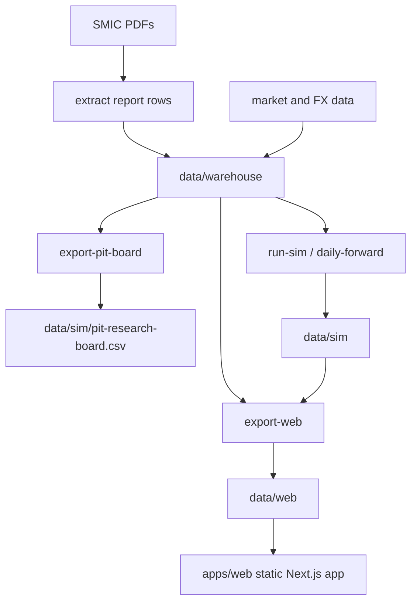

# SNUSMIC Portfolio Lab

SNUSMIC Portfolio Lab turns SMIC research reports into point-in-time datasets, account simulations, and static web artifacts. The latest release closes the PIT strategy research sprint: generated candidates are documented in `docs/research`, while the web app exposes only a curated shortlist of representative account ledgers.

[Live site](https://smic-portfolio.vercel.app) - [Changelog](./CHANGELOG.md) - [Design system](./DESIGN.md)

## What This Repo Does

- Collects SMIC report PDFs and extracted report rows.
- Normalizes reports, prices, FX, and benchmark data into `data/warehouse`.
- Exports a point-in-time research board at `data/sim/pit-research-board.csv`.
- Runs benchmark, follower, and curated PIT account simulations with real ledger constraints: cash, deposits, integer shares, fees, taxes, trades, holdings, and equity paths.
- Exports deterministic `data/web` JSON/CSV artifacts consumed by the static Next.js app.
- Presents report verification, statistics, and account views through page-shaped frontend view models instead of raw artifact tables.
- Shows curated PIT/follower account curves alongside benchmarks, with dense trade markers and benchmark lines controlled in the chart UI.

## What It Does Not Do

- No live broker integration or order entry.
- No live market-data fetches in the web app.
- No future-looking signals in PIT account simulations.
- No automatic admission of every generated research branch into the product UI.

## Core Commands

The repo uses Python and Node entrypoints instead of shell scripts so the same commands work on macOS and Windows.

```bash
uv sync --group dev
pnpm --dir apps/web install
```

Refresh data and static artifacts:

```bash
python -m snusmic_pipeline refresh-web-artifacts
```

Full rebuild:

```bash
python -m snusmic_pipeline rebuild-web-artifacts
```

Manual PIT dataset export:

```bash
python -m snusmic_pipeline export-pit-board --warehouse data/warehouse --out data/sim/pit-research-board.csv --start 2021-01-04 --cadence M
```

Fixed account simulation:

```bash
python -m snusmic_pipeline run-sim --warehouse data/warehouse --out data/sim
```

Web artifact export:

```bash
python -m snusmic_pipeline export-web --warehouse data/warehouse --sim data/sim --out data/web
```

## Curated Portfolio Set

The generated artifacts may contain many research branches. `/portfolio` intentionally shows only the representative shortlist:

| Display name | What it means |
| --- | --- |
| Partial 75 | Current local-return candidate. Quarterly Top5 PIT trend account; retains winners, trims large winners after a 25% pullback from observed holding-period high toward a 20% account weight, and redeploys only 75% of eligible cash when cash is at least 12.5% of equity. |
| CashGate 12.5 | Robustness baseline for Partial 75. Same retained-winner/trailing-trim shell, but redeploys only when cash reaches the 12.5% gate. |
| TrailTrim 20 | Simpler profit-protection baseline. Keeps the PIT trend shell and trims concentrated winners toward a 20% cap without the cash redeploy branch. |
| Trend Top5 | Simple point-in-time trend-score Top5 account. Useful as the low-complexity reference. |
| Score Top5 | Simple point-in-time score Top5 account. Useful for checking whether the trend construction adds value. |
| SMIC Follower | Report-follower baseline that tracks actual report-driven account behavior. |

All Weather, KODEX 200, QQQ, SPY, and GLD remain comparison benchmarks. Forward-looking oracle simulations remain diagnostics, not product accounts.

## Data Flow



## Documentation

| Document | Purpose |
| --- | --- |
| [docs/product-spec.md](./docs/product-spec.md) | Product intent and priorities |
| [docs/data-artifact-policy.md](./docs/data-artifact-policy.md) | Committed data ownership and generated-cache policy |
| [docs/backtest-contract.md](./docs/backtest-contract.md) | Account, PIT, and no-lookahead contract |
| [docs/technical-architecture.md](./docs/technical-architecture.md) | Pipeline, artifact, and route map |
| [DESIGN.md](./DESIGN.md) | UI design system |

## Web App

The web app is a static reader over committed artifacts. It must not call live market APIs or reconstruct simulation logic in the browser.

Main routes:

- `/`
- `/portfolio`
- `/portfolio/[account]`
- `/portfolio/[account]/equity`
- `/portfolio/[account]/holdings`
- `/portfolio/[account]/trades`
- `/reports`
- `/reports/[symbol]/[reportId]`
- `/calendar`
- `/statistics`

## Validation

```bash
uv run ruff check src tests scripts
uv run pytest -q -m "not slow" -x
pnpm --dir apps/web artifact:check
pnpm --dir apps/web typecheck
pnpm --dir apps/web exec biome check .
pnpm --dir apps/web build
pnpm --dir apps/web smoke:static
```

`tests/test_web_artifacts.py` is a release-gate contract suite. It performs a full web export and should not be used as the default edit-test loop.

Deployment build, also cross-platform:

```bash
pnpm build
node scripts/prepare_vercel_prebuilt.mjs
```

## Project Layout

```text
apps/web/                  Static Next.js app
data/warehouse/            Normalized report, price, FX, and benchmark inputs
data/sim/                  Simulation outputs and PIT research board
data/web/                  Canonical static web artifacts
docs/                      Product, architecture, testing, and agent docs
scripts/                   Operational rebuild/refresh helpers
src/snusmic_pipeline/      Python package and CLI
tests/                     Pytest suite
```

## Current Contract

This repo is now intentionally PIT-first:

1. Build trustworthy point-in-time data.
2. Keep benchmark/follower simulations for context.
3. Record strategy ideas, results, and retrospectives in Markdown before promoting any account.
4. Show only a curated shortlist in the product UI so parameter search output does not look like investable truth.
