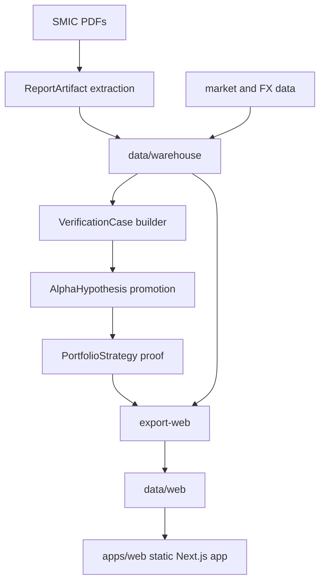

# SNUSMIC Portfolio Lab

SNUSMIC Portfolio Lab은 SMIC 리서치 리포트를 **검증 케이스(VerificationCase)**, **알파 가설(AlphaHypothesis)**, **포트폴리오 증명(PortfolioStrategy proof)** 으로 연결하는 point-in-time(PIT) 연구 검증 시스템입니다. 목표는 PDF 리포트에서 markdown과 structured artifact를 함께 만들고, 그 리포트 주장(목표가/논지)이 실제로 어떻게 전개됐는지 downside까지 포함해 검증한 뒤, 반복 규칙을 알파로 승격시키고, 마지막에 그 알파가 all weather나 index를 이길 수 있는지 증명하는 것입니다.

[English README](./README.en.md) - [Live site](https://smic-portfolio.vercel.app) - [Changelog](./CHANGELOG.md) - [Design system](./DESIGN.md)

### 이 저장소가 하는 일

- SMIC 리포트 PDF와 추출된 리포트 행을 수집합니다.
- 리포트, 가격, FX, 벤치마크 데이터를 `data/warehouse`의 PIT warehouse로 정규화합니다.
- PDF마다 **markdown evidence + structured extraction artifact**를 함께 유지할 수 있는 추출 파이프라인을 가집니다.
- 리포트 주장(목표가/논지)의 사후 가격 경로를 **VerificationCase**로 검증합니다.
- 여러 검증 케이스에서 반복적으로 살아남는 selection rule을 **AlphaHypothesis**로 승격합니다.
- alpha를 하나 이상의 **PortfolioStrategy**로 연결해 all weather 또는 index 대비 우위를 증명합니다.
- 정적 Next.js 앱이 읽는 결정론적 `data/web` JSON/CSV 아티팩트를 생성합니다.
- 웹 앱은 **Verification -> Alpha -> Portfolio proof** 순서로 evidence를 보여주고, 과거 daily 기준의 매수/매도 이유·수량·가격·손익 trace를 추적할 수 있게 합니다.

### 하지 않는 일

- 실시간 브로커 연동이나 주문 제출을 하지 않습니다.
- 웹 앱에서 실시간 market data를 가져오지 않습니다.
- PIT 검증과 전략 증명에서 미래 정보를 쓰지 않습니다.
- 생성된 모든 research branch를 자동으로 product UI에 올리지 않습니다.
- account ledger나 체결 로그를 core object로 취급하지 않습니다.

### 핵심 명령

이 저장소는 shell script 대신 Python/Node entrypoint를 사용해 macOS, Windows, CI에서 같은 명령을 실행합니다.

```bash
uv sync --locked --group dev
pnpm --dir apps/web install --frozen-lockfile --prefer-offline
```

데이터와 정적 artifact 갱신:

```bash
uv run --locked python -m snusmic_pipeline refresh-web-artifacts
```

전체 재생성:

```bash
uv run --locked python -m snusmic_pipeline rebuild-web-artifacts
```

수동 PIT dataset export:

```bash
uv run --locked python -m snusmic_pipeline export-pit-board --warehouse data/warehouse --out data/sim/pit-research-board.csv --start 2021-01-04 --cadence M
```

고정 계좌 시뮬레이션:

```bash
uv run --locked python -m snusmic_pipeline run-sim --warehouse data/warehouse --out data/sim
```

웹 artifact export:

```bash
uv run --locked python -m snusmic_pipeline export-web --warehouse data/warehouse --sim data/sim --out data/web
```

외부 object storage나 별도 artifact mirror로 큰 portfolio shard를 내보내려면 아래 옵션을 같이 쓸 수 있습니다.

```bash
uv run --locked python -m snusmic_pipeline export-web --warehouse data/warehouse --sim data/sim --out data/web --external-artifact-dir data/external-web-artifacts --external-artifact-url-root https://static.example.com/snusmic/
```

`--external-artifact-dir`를 쓰면 `--external-artifact-url-root`도 같이 필요합니다. Product summary/page artifact는 계속 `data/web`에 남고, 큰 `portfolio/equity/*.json`·`portfolio/daily-decisions/*.json` shard는 manifest pointer와 함께 외부 저장소로 분리할 수 있습니다.

### 현재 제품의 중심 개념

이 저장소의 product nucleus는 더 이상 “계좌 원장”이 아닙니다.

| Object | 역할 |
| --- | --- |
| `ReportArtifact` | PDF, markdown, structured extraction 결과를 담는 source document artifact |
| `VerificationCase` | 특정 리포트 주장(목표가/논지)의 사후 검증 단위 |
| `AlphaHypothesis` | 여러 검증 케이스에서 반복적으로 살아남는 selection rule |
| `PortfolioStrategy` | alpha를 allocation/rebalance/risk rule로 연결해 benchmark와 비교하는 proof layer |
| `Execution trace` | 과거 daily 기준으로 언제, 왜, 무엇을, 얼마나 사고팔았고 손익이 어땠는지 보여주는 설명 가능한 기록 |

실계좌 브로커 연동이나 주문 제출은 현재 제품의 비목표입니다. 대신 사람이 “이 포트폴리오가 왜 이렇게 사고팔았는지”를 따라갈 수 있을 정도의 historical trace를 보여주는 것이 목표입니다.

### 선별 포트폴리오

생성된 artifact는 기본적으로 대표 shortlist만 포함합니다. 대량 parameter-search branch는 연구 기록에는 남기지만, 웹 데이터에는 재생성하지 않아 payload와 증명 화면을 작게 유지합니다.

| account_id | 표시 이름 | 의미 |
| --- | --- | --- |
| `pit_trend_quarterly_fresh540_runwinners_weeklycap45_profit60_mixedentry_trailtrim25cap20_redeploycash125_partial75_top5` | Partial 75 | 현재 local-return 후보. Quarterly Top5, retained winners, trailing trim, 12.5% cash gate, trim cash의 75% redeploy를 쓰는 실험 후보입니다. |
| `pit_trend_quarterly_fresh540_runwinners_weeklycap45_profit60_mixedentry_trailtrim25cap20_redeploycash125_top5` | CashGate 12.5 | Partial 75 직전의 redeploy gate robustness 기준 전략입니다. |
| `pit_trend_quarterly_fresh540_runwinners_weeklycap45_profit60_mixedentry_trailtrim25cap20_top5` | Mixed Entry TrailTrim 20 | candidate entry와 board retention을 섞고 trailing trim을 쓰는 기준 전략입니다. |
| `pit_trend_quarterly_fresh540_runwinners_weeklycap45_profit60_candidate_top5` | Candidate Profit60 | candidate-score admission 비교 전략입니다. |
| `pit_trend_quarterly_fresh540_runwinners_weeklycap45_profit60_top5` | Profit60 | board-score / weekly-cap / profit-cushion baseline 전략입니다. |
| `pit_momentum_1m3m_top5`, `pit_momentum_3m6m_top5`, `pit_momentum_6m12m_top5`, `pit_mtt_rs70_top5`, `pit_mtt_rs80_top5`, `pit_mtt_rs90_top5`, `pit_mtt_low100_top5`, `pit_mtt_low300_top5` | Momentum/MTT variants | 비교용 representative 전략군입니다. |
| `pit_trend_top5`, `pit_score_top5`, `smic_follower` | Trend / Score / Follower baselines | 단순 baseline 또는 follower proof 전략입니다. |

### 데이터 흐름



### 문서

| 문서 | 목적 |
| --- | --- |
| [docs/product-spec.md](./docs/product-spec.md) / [EN](./docs/product-spec.en.md) | verification-first 제품 의도와 우선순위 |
| [docs/data-artifact-policy.md](./docs/data-artifact-policy.md) / [EN](./docs/data-artifact-policy.en.md) | 커밋되는 데이터의 소유권과 생성 캐시 정책 |
| [docs/backtest-contract.md](./docs/backtest-contract.md) / [EN](./docs/backtest-contract.en.md) | PIT / no-lookahead 계약 |
| [docs/technical-architecture.md](./docs/technical-architecture.md) / [EN](./docs/technical-architecture.en.md) | pipeline, artifact, route map |
| [DESIGN.md](./DESIGN.md) | UI design system |

### 웹 앱

웹 앱은 커밋된 artifact를 읽는 정적 reader입니다. live market API를 호출하거나 browser에서 시뮬레이션 logic을 재구성하면 안 됩니다.
기본 serving mode는 **local committed shards**입니다. `external_artifacts` pointer는 optional path이며, hydrate / validate / build proof를 다시 통과하기 전에는 기본 배포 경로로 취급하지 않습니다.

주요 route:
- `/` — VerificationCase board
- `/alpha` — AlphaHypothesis board
- `/reports` — source report / evidence drilldown
- `/reports/[symbol]/[reportId]`
- `/calendar` — PIT 관측일 진단
- `/statistics` — 검증 케이스 분포 진단
- `/portfolio` — portfolio proof catalogue
- `/portfolio/[account]` — selected strategy proof
- `/portfolio/[account]/holdings` — proof를 구성하는 현재 포지션
- `/portfolio/[account]/trades` — historical execution trace

### 검증

```bash
uv run --locked ruff check src tests scripts
uv run --locked pytest -q -m "not slow" -x
pnpm --dir apps/web artifact:check
pnpm --dir apps/web typecheck
pnpm --dir apps/web exec biome check .
pnpm --dir apps/web build
pnpm --dir apps/web smoke:static
```

`tests/test_web_artifacts.py`는 release-gate contract suite입니다. full web export를 수행하므로 기본 edit-test loop로 쓰지 않습니다.

### 프로젝트 구조

```text
apps/web/                  정적 Next.js 앱
data/warehouse/            정규화된 report, price, FX, benchmark input
data/sim/                  simulation output과 PIT research board
data/web/                  canonical static web artifact, portfolio series는 선별 전략별 shard
docs/                      제품, 아키텍처, 테스트, agent 문서
scripts/                   운영용 rebuild/refresh helper
src/snusmic_pipeline/      Python package와 CLI
tests/                     Pytest suite
```

### 현재 계약

이 저장소는 PIT-first입니다.

1. 신뢰할 수 있는 point-in-time data를 만듭니다.
2. VerificationCase를 중심으로 evidence를 정리합니다.
3. 반복 규칙만 AlphaHypothesis로 승격합니다.
4. 전략 proof만 product UI에 노출합니다.
5. parameter search output이 investable truth처럼 보이지 않도록 curated surface를 유지합니다.

### 데이터 아티팩트 주의

이 저장소는 정적 웹 배포를 재현하기 위해 일부 데이터 아티팩트를 의도적으로 커밋합니다. 특히 `data/warehouse/daily_prices.csv`는 clone 크기에 영향을 줍니다. 어떤 데이터가 source-of-truth이고 어떤 파일이 재생성 가능한 cache인지에 대한 기준은 [docs/data-artifact-policy.md](./docs/data-artifact-policy.md)를 따릅니다.
