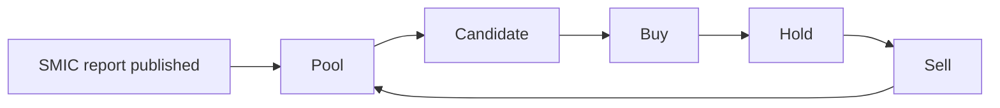

# Backtest Contract

Last updated: 2026-05-22
Status: canonical simulation contract

## Purpose

이 문서는 SMIC 커버 종목 액티브 매매 실험이 반드시 지켜야 하는 계약이다. 새 전략, 새 팩터, 새 UI는 이 계약을 먼저 만족해야 한다.

## Account contract

| 항목 | 기본값 |
| --- | --- |
| 시작 자본 | 10,000,000원 |
| 적립 방식 | 월별 적립금. 금액은 설정값으로 둔다 |
| 체결 단위 | 정수 주식 |
| 평가 통화 | KRW |
| 가격 | 일별 OHLCV, 기본 평가는 종가 |
| 비용 | 수수료, 세금, 슬리피지를 명시적으로 적용하거나 0으로 둔 이유를 기록 |
| 현금 | 미투자 현금은 계좌에 남기고, 이자 가정이 있으면 별도 파라미터로 둔다 |

전략 평가는 vector return이 아니라 share-based ledger로 한다. 매수, 매도, 현금, 평균단가, 실현손익, 미실현손익이 모두 계좌 원장에 남아야 한다.

## Time and lookahead contract

기본 원칙은 단순하다.

> 오늘 종가까지 알아야 계산되는 신호는 내일 종가에 체결한다.

같은 날 종가 체결을 쓰려면 그 신호가 오늘 종가를 사용하지 않았다는 사실을 전략 문서에 명시해야 한다. 예를 들어 publication event만으로 당일 종가 매수를 허용할 수는 있지만, 오늘의 종가 수익률, MA, MACD, 52주 고점 거리, 목표가 도달 여부를 계산한 뒤 같은 종가로 체결하면 lookahead다.

## Pool to trade lifecycle

| 단계 | 계약 |
| --- | --- |
| Pool | SMIC가 point-in-time으로 커버한 종목만 들어온다 |
| Candidate | 오늘까지 알 수 있는 가격, 리포트, 보유 상태로 선별한다 |
| Buy | 현금, 슬롯 수, 최대 비중, 재진입 제한을 통과해야 한다 |
| Hold | 보유 중에도 매일 종가 기준 sell rule을 평가한다 |
| Sell | 익절, 손절, 추세 이탈, 기간 만료, 목표 도달, 리밸런싱 사유를 하나 이상 기록한다 |

## Strategy declaration

모든 실험은 실행 전에 아래를 선언해야 한다.

| 항목 | 예 |
| --- | --- |
| Hypothesis | 6개월 수익률 상위 SMIC 종목을 보유하고 20일선 이탈 시 판다 |
| Lever | buy timing, sell timing, sizing, cash/fallback 중 무엇을 바꾸는가 |
| Universe | SMIC pool 전체, 최근 500거래일 커버 종목, 신규 리포트 후 N일 이내 등 |
| Signal timing | close[t] 사용 후 close[t+1] 체결 |
| Benchmark | 올웨더, KODEX 200, 단순 SMIC follower 등 |
| Objective | 최종 평가액, MWR, 올웨더 대비 초과수익 |
| Guardrails | 최대 보유 수, 최대 비중, 재진입 조건, 손절 조건 |

## Metrics

| 우선순위 | 지표 | 용도 |
| --- | --- | --- |
| 1 | Final equity | 같은 적립금으로 최종 얼마가 됐는가 |
| 1 | MWR | 적립식 현금흐름을 반영한 수익률 |
| 1 | Net profit | 원화 기준 벌었는가 |
| 2 | Excess vs All Weather | 이 프로젝트의 핵심 비교 |
| 2 | Trade reasons | 돈을 번 원인이 규칙으로 설명되는가 |
| 3 | MDD | 버틸 수 있는 낙폭인지 보는 보조 지표 |
| 3 | Win rate, hit rate | 설명용 보조 지표 |

## Forbidden shortcuts

- 발간 이후 최대 상승률을 알고 매수 후보를 고르기
- 목표가 도달 여부를 알고 포트폴리오에 넣기
- 만료 후 결과 라벨로 매수 후보를 고르기
- 종목별 미래 수익률로 ranking한 뒤 같은 기간 성과로 평가하기
- 실패 실험을 UI에서 조용히 지워서 성과가 좋아 보이게 만들기
- benchmark와 strategy를 같은 목록에서 같은 의미로 섞기

## Runtime lanes

기본 end-to-end는 실제 운용 가능한 계좌 전략만 돌린다. 아래 lane은 느리거나 연구용이므로 opt-in이다.

| Lane | 기본값 | 켜는 법 | 이유 |
| --- | --- | --- | --- |
| Future-information oracle | off | `--include-oracle` | SciPy 최적화가 느리고 실제 운용 전략이 아니다 |
| Stock-rule exhaustive search | off | `--stock-persona-top N` | factor zoo 성격의 보조 실험이다 |
| PIT research-board rotation | off | `--pit-strategy-top N` | 후보판 재계산이 느리고 core 계좌 전략보다 보조적이다 |
| Broker MTT search | on with cache | `SMIC_DISABLE_BROKER_STRATEGY_REUSE=1`로 재탐색 | 계좌형 매매 규칙 탐색이라 core에 가깝다 |

## Report labels

리포트 라벨은 두 종류로 분리한다.

| 라벨 | 목적 |
| --- | --- |
| Stock quality label | 발간 후 일정 기간의 경로가 좋은 종목이었는지 설명한다 |
| Operation label | 손절, 익절, 추세 필터로 실제 계좌가 먹거나 피할 수 있었는지 설명한다 |

두 라벨은 전략 선택의 보조 증거다. 기본 전략 선택 기준은 계좌 성과다.
