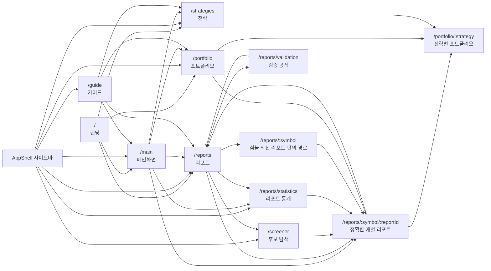

# 내비게이션 아키텍처

Last updated: 2026-05-19

## 캐노니컬 라우트 맵

## 라우트별 사용자 작업

| 라우트 | 사용자 작업 | 메모 |
| --- | --- | --- |
| `/` | 앱 소개와 주요 진입 | 공개 랜딩. 앱 내부 분석은 하지 않습니다. |
| `/main` | 오늘 볼 요약과 검토 대기열 | 메인화면의 유일한 앱 요약 라우트. |
| `/portfolio` | 기본 전략 보유·매매·성과 확인 | 현재 상위 고유 전략을 자동 노출. 전략 선택은 정적 `/portfolio/:strategy` 링크 사용. |
| `/portfolio/:strategy` | 특정 전략 보유·매매·성과 확인 | 선택 전략 데이터만 페이지 payload에 실음. 없는 전략은 404. |
| `/reports` | 전체 리포트 표본 검색·정렬·후보 탐색 | 후보 탐색은 별도 라우트가 아닌 이 통합 테이블의 필터/정렬 역할. |
| `/screener` | 가격 매칭 메트릭(YTD/1Y/52W/SMA)이 결합된 후보 보드 | 스프레드시트형 컬럼 필터·연산자 표현식 사용. `/reports`와 표면을 공유하지 않고 가격 인지형 시각으로 분리. |
| `/reports/statistics` | fat-tail 리포트 통계, 전체 표본, 경로 고통, 파라미터 실험 | 사이드바에 직접 노출되는 분석 페이지. |
| `/reports/validation` | 계산식·제외 규칙 설명 | 통계 페이지와 표의 보조 문서. |
| `/reports/:symbol/:reportId` | 개별 리포트 근거 분석 | 표·포트폴리오·통계의 기본 드릴다운 목적지. v0.21.4 이후 표 중심 슬림 뷰. |
| `/reports/:symbol` | 심볼 최신 리포트 편의 경로 | 직접 입력/공유 편의를 위한 보조 경로. 새 목록 링크는 `reportId`가 있으면 exact route를 사용. |
| `/strategies` | 전략 성과와 기준선 비교 | 상세 포트폴리오 이동은 `/portfolio/:strategy`. |
| `/guide` | 읽는 법과 주의사항 | 분석 페이지가 아니라 온보딩 문서. |

## 명령 팔레트

`⌘K` / `Ctrl+K`로 열리는 글로벌 명령 팔레트는 위 라우트 외에 다음을 인덱싱합니다.

- **페이지** — `APP_NAV` 항목 전체.
- **전략** — `getStrategyCatalog()`의 `isSelectable=true` 페르소나 전부 (`/portfolio/:strategy`).
- **종목** — `getReportRows()`에서 심볼별 1건씩 deduped (`/reports/:symbol`).

각 결과는 `kind` 칩(페이지·전략·종목)을 달고 라벨/설명/심볼 keywords로 필터링됩니다.

## 삭제된 라우트

| 삭제된 라우트 | 대체 | 사유 |
| --- | --- | --- |
| `/snapshot` | `/main` | 별칭이 남아 있으면 메인화면 개편 후에도 오래된 사고방식이 되살아납니다. 숨은 호환 라우트 대신 404로 실패시킵니다. |

## 링크 규칙

1. **사이드바가 제품 IA**: 보이는 최상위 앱 링크는 `apps/web/components/ui/app-shell-nav.ts` 한 곳에 정의합니다.
2. **가장 긴 활성 경로 우선**: `/reports/statistics`에서는 "리포트 통계"가 강조되고, 더 짧은 "리포트"가 강조되지 않아야 합니다. `SidebarNav`가 longest matching active path로 해결합니다.
3. **리포트 표와 스크리너 표면 분리**: `/reports`는 리포트 표본 검증을 다루고, `/screener`는 가격 매칭 메트릭 기반 후보 검토를 다룹니다. 같은 표가 두 페이지에 등장하지 않아야 합니다.
4. **통계는 헤더 KPI 덤프가 아니다**: 분포, 분위, 꼬리 카운트, 경로 고통, 지연 진입, 목표 후 드리프트, target-multiple 실험 같은 장문 표본 해석을 소유합니다.
5. **행은 가장 구체적인 목적지로**: 리포트 행은 `reportId`가 있으면 `/reports/:symbol/:reportId`로, 전략 행은 `/portfolio/:strategy`로 보냅니다.
6. **원본 PDF/마크다운은 상세 페이지 안에**: raw 아티팩트 링크를 1차 내비게이션에 두지 않습니다.
7. **숨은 fallback 라우트 금지**: 삭제된 라우트는 향후 마이그레이션 계획이 명시되지 않는 한 리다이렉트·호환 페이지를 유지하지 않습니다. legacy `/portfolio?strategy=...`는 유효 ID에 대해 클라이언트 마이그레이션 안내/리다이렉트로만 동작하고 데이터 fallback이 아닙니다.

## 페이지 변경 시 점검 리스트

- [ ] 보이는 사이드바 라우트는 `app-shell-nav.ts`에서 변경합니다.
- [ ] 라우트 추가·삭제·용도 변경 시 이 Mermaid 맵을 갱신합니다.
- [ ] 라우트 변경 후 `/`, `/main`, `/reports`, `/reports/statistics`, `/portfolio`, `/screener`, `/strategies`, `/guide`가 모두 HTTP 200을 반환하는지 확인합니다.
- [ ] 삭제된 라우트 이름이 빌드 결과물에 등장하지 않는지 확인합니다.
- [ ] 같은 작업을 위한 페이지를 중복 생성하지 않습니다. 평행 UI 표면 대신 필터·프리셋·정확한 링크를 우선합니다.
