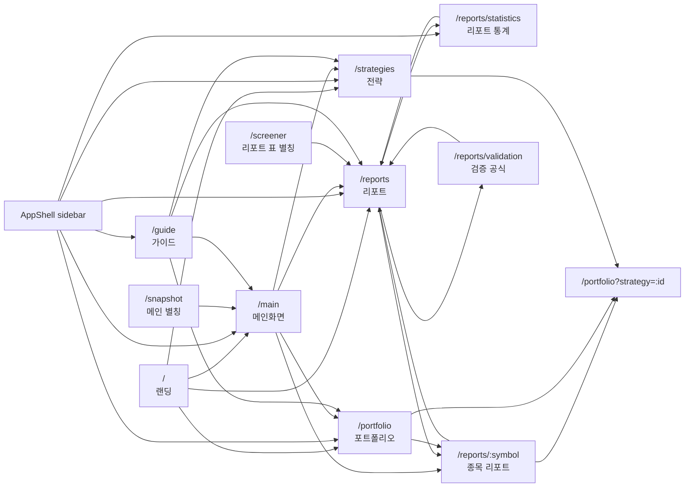

# Navigation Architecture

Last updated: 2026-05-14

## Canonical route map

## Route jobs

| Route | User job | Notes |
| --- | --- | --- |
| `/` | 앱 소개와 주요 진입 | 공개 랜딩. 앱 내부 분석은 하지 않음. |
| `/main` | 오늘 볼 요약과 검토 대기열 | `/snapshot`은 같은 목적의 별칭으로 유지. |
| `/portfolio` | 전략별 보유·매매·성과 확인 | 쿼리 `strategy`가 선택 상태를 결정. |
| `/reports` | 전체 리포트 표본 검색·정렬·후보 탐색 | `/screener`는 이 화면의 별칭. 새 기능은 이 표로 통합. |
| `/reports/statistics` | fat-tail 리포트 통계, 전체 표본, 경로 고통, 파라미터 실험 | 사이드바에 직접 노출되는 분석 페이지. |
| `/reports/validation` | 계산식·제외 규칙 설명 | 통계 페이지와 표의 보조 문서. |
| `/reports/:symbol` | 개별 종목/리포트 근거 분석 | 표·포트폴리오·히트맵의 드릴다운 목적지. |
| `/strategies` | 전략 성과와 기준선 비교 | 상세 원장 이동은 `/portfolio?strategy=:id`. |
| `/guide` | 읽는 법과 주의사항 | 분석 페이지가 아니라 온보딩 문서. |

## Link rules

1. **Sidebar is the product IA.** Visible top-level app links live in `apps/web/components/ui/app-shell-nav.ts` only.
2. **Longest active route wins.** `/reports/statistics` must highlight “리포트 통계”, not the broader “리포트”. `SidebarNav` resolves this by longest matching active path.
3. **Reports table and screener are one surface.** `/screener` may remain as a compatibility alias, but new sorting/filtering work should improve `/reports` rather than fork a second table.
4. **Statistics is not a header KPI dump.** It owns long-form sample interpretation: full distribution, quantiles, tail counts, path pain, delayed entry, post-target drift, target-multiple experiments.
5. **Rows choose the most specific destination.** Report/symbol rows go to `/reports/:symbol`; strategy rows go to `/portfolio?strategy=:id`.
6. **External PDFs and markdown stay inside detail source panels.** Do not put raw artifact links into primary navigation.

## Maintenance checklist for page changes

- [ ] Add or change visible sidebar routes in `app-shell-nav.ts`.
- [ ] Update this Mermaid map when adding, deleting, or repurposing routes.
- [ ] Verify `/reports`, `/reports/statistics`, `/portfolio`, `/strategies`, `/guide`, and `/` still return HTTP 200 after route changes.
- [ ] Avoid duplicate pages for the same job; prefer aliases or presets over parallel UI surfaces.
