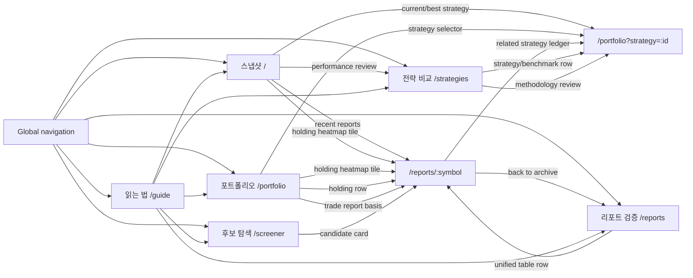

# Navigation Architecture

Last updated: 2026-05-13

## Link Structure

## Link Rules

1. **One route, one job.** `/` is the snapshot board; `/portfolio` owns selected strategy ledgers; `/reports/:symbol` owns stock/report detail analysis.
2. **Rows choose the most specific destination.** Strategy rows go to `/portfolio?strategy=:id`; report, screener, trade-basis, and report-backed holding rows go to `/reports/:symbol`.
3. **Heatmaps are drill-down surfaces.** A clickable holding tile opens the latest available report detail for that symbol. Cash and non-report benchmark holdings stay non-clickable.
4. **Ranking views do not create new destinations.** Ranking presets change sort/filter state over the unified Reports table, then rows still open `/reports/:symbol`.
5. **Guide links are onboarding shortcuts only.** Guide cards should not duplicate every dashboard CTA; they should teach the main product flow.

## Simplification Plan

1. Replace generic strategy links with `/portfolio?strategy=:id`.
2. Make report-backed heatmap tiles open `/reports/:symbol`.
3. Remove duplicated CTA clusters that point to the same page without adding a distinct user job.
4. Keep Reports ranking modes as presets on the unified table; do not add parallel ranking destinations.
5. Keep external PDF/markdown links only inside report detail source panels.
