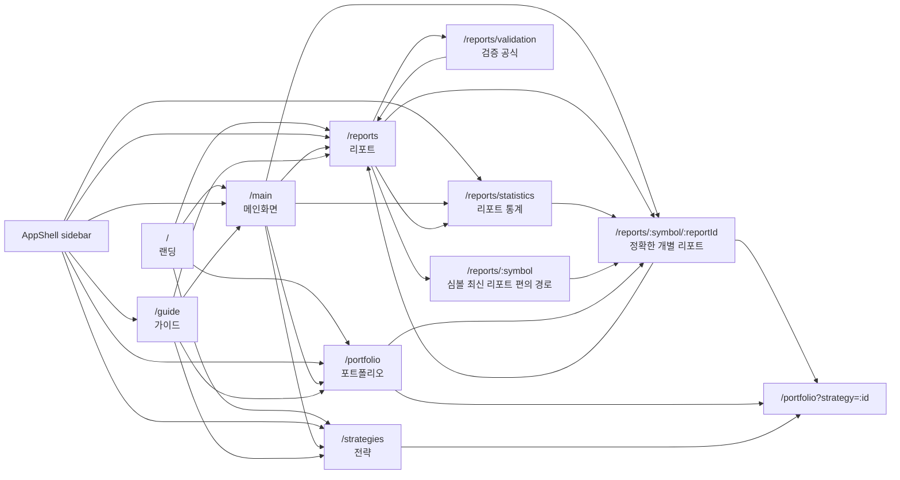

# Navigation Architecture

Last updated: 2026-05-15

## Canonical route map

## Route jobs

| Route | User job | Notes |
| --- | --- | --- |
| `/` | 앱 소개와 주요 진입 | 공개 랜딩. 앱 내부 분석은 하지 않음. |
| `/main` | 오늘 볼 요약과 검토 대기열 | 메인화면의 유일한 앱 요약 라우트. |
| `/portfolio` | 전략별 보유·매매·성과 확인 | 쿼리 `strategy`가 선택 상태를 결정. |
| `/reports` | 전체 리포트 표본 검색·정렬·후보 탐색 | 후보 탐색은 별도 라우트가 아니라 이 통합 테이블의 필터/정렬 역할. |
| `/reports/statistics` | fat-tail 리포트 통계, 전체 표본, 경로 고통, 파라미터 실험 | 사이드바에 직접 노출되는 분석 페이지. |
| `/reports/validation` | 계산식·제외 규칙 설명 | 통계 페이지와 표의 보조 문서. |
| `/reports/:symbol/:reportId` | 개별 리포트 근거 분석 | 표·포트폴리오·통계의 기본 드릴다운 목적지. |
| `/reports/:symbol` | 심볼 최신 리포트 편의 경로 | 직접 입력/공유 편의를 위한 보조 경로. 새 목록 링크는 `reportId`가 있으면 exact route를 쓴다. |
| `/strategies` | 전략 성과와 기준선 비교 | 상세 원장 이동은 `/portfolio?strategy=:id`. |
| `/guide` | 읽는 법과 주의사항 | 분석 페이지가 아니라 온보딩 문서. |

## Deleted routes

| Deleted route | Replacement | Reason |
| --- | --- | --- |
| `/snapshot` | `/main` | 별칭이 남아 있으면 메인화면 개편 후에도 오래된 사고방식이 되살아난다. 숨은 호환 라우트 대신 404로 실패시킨다. |
| `/screener` | `/reports` | 후보 탐색은 리포트 표본의 정렬/필터 문제다. 별도 화면을 유지하면 표 UI와 데이터 해석이 갈라진다. |

## Link rules

1. **Sidebar is the product IA.** Visible top-level app links live in `apps/web/components/ui/app-shell-nav.ts` only.
2. **Longest active route wins.** `/reports/statistics` must highlight “리포트 통계”, not the broader “리포트”. `SidebarNav` resolves this by longest matching active path.
3. **Reports table and candidate discovery are one surface.** `/reports` owns the searchable, sortable table; presets and filters belong there.
4. **Statistics is not a header KPI dump.** It owns long-form sample interpretation: full distribution, quantiles, tail counts, path pain, delayed entry, post-target drift, target-multiple experiments.
5. **Rows choose the most specific destination.** Report rows go to `/reports/:symbol/:reportId` when `reportId` exists; strategy rows go to `/portfolio?strategy=:id`.
6. **External PDFs and markdown stay inside detail source panels.** Do not put raw artifact links into primary navigation.
7. **No hidden fallback routes.** If a route was deleted, do not keep redirects or compatibility pages unless a future migration plan explicitly reintroduces them.

## Maintenance checklist for page changes

- [ ] Add or change visible sidebar routes in `app-shell-nav.ts`.
- [ ] Update this Mermaid map when adding, deleting, or repurposing routes.
- [ ] Verify `/`, `/main`, `/reports`, `/reports/statistics`, `/portfolio`, `/strategies`, and `/guide` still return HTTP 200 after route changes.
- [ ] Verify deleted route names do not appear in build output.
- [ ] Avoid duplicate pages for the same job; prefer filters, presets, or exact links over parallel UI surfaces.
