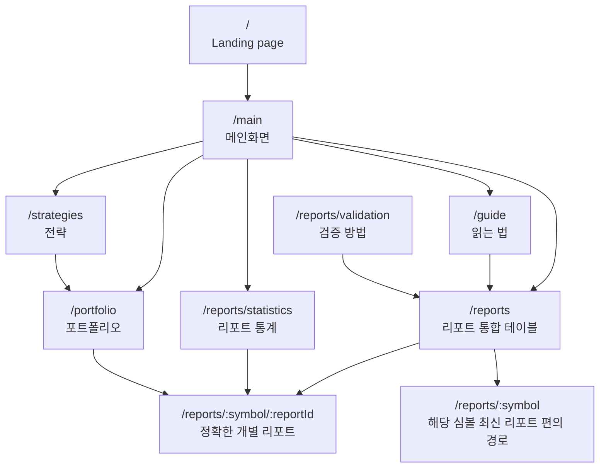
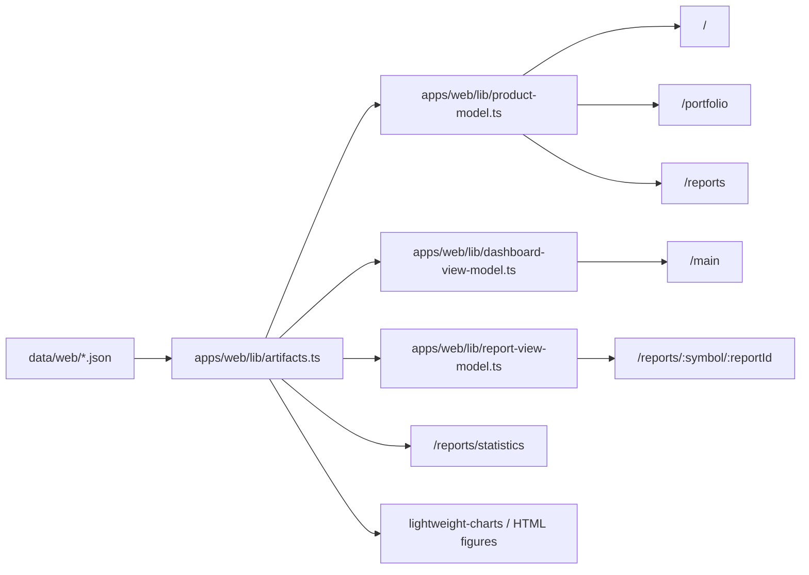

# SNUSMIC Portfolio Lab page and artifact map

Updated: 2026-05-15

This document is the current routing/data contract after the reports/statistics/portfolio cleanup. Code is the source of truth; this map exists to prevent hidden legacy routes and duplicate UI surfaces from drifting apart.

## Route map

### Route ownership

| Route | Owner file | Role | Keep / delete decision |
| --- | --- | --- | --- |
| `/` | `apps/web/app/page.tsx` | Public landing page and app entry | Keep |
| `/main` | `apps/web/app/(app)/main/page.tsx` | Main product dashboard | Keep |
| `/portfolio` | `apps/web/app/(app)/portfolio/page.tsx` | Portfolio, trades, accounting, strategy selection | Keep |
| `/reports` | `apps/web/app/(app)/reports/page.tsx` | Single report and candidate table surface | Keep |
| `/reports/statistics` | `apps/web/app/(app)/reports/statistics/page.tsx` | Research-style statistics story | Keep |
| `/reports/validation` | `apps/web/app/(app)/reports/validation/page.tsx` | Methodology explanation | Keep |
| `/reports/:symbol` | `apps/web/app/(app)/reports/[symbol]/page.tsx` | Latest report convenience route | Keep as convenience, but table/statistics deep links should prefer exact route |
| `/reports/:symbol/:reportId` | `apps/web/app/(app)/reports/[symbol]/[reportId]/page.tsx` | Exact historical report identity | Primary detail route |
| `/strategies` | `apps/web/app/(app)/strategies/page.tsx` | Strategy leaderboard and comparison | Keep |
| `/guide` | `apps/web/app/(app)/guide/page.tsx` | User-facing reading guide | Keep |

## Artifact flow

## Key artifacts by product question

| User question | Artifact | Primary UI |
| --- | --- | --- |
| 지금 포트폴리오가 왜 이 금액인가 | `personas.json`, `current-holdings.json`, `accounting-reconciliation.json`, `equity-daily.json`, `trades.json` | `/portfolio` |
| 리포트는 얼마나 맞았나 | `reports.json`, `report-statistics-lab.json`, `target-hit-distribution.json` | `/reports/statistics` |
| 개별 리포트가 어떤 경로를 거쳤나 | `reports.json`, `prices/*`, `report-detail-metrics.json` | `/reports/:symbol/:reportId` |
| 어떤 리포트를 다시 봐야 하나 | `reports.json`, `report-rankings.json`, `screener/*` | `/reports` |
| 어떤 전략이 돈을 벌었나 | `personas.json`, `strategies/catalog.json`, `equity-daily.json` | `/portfolio`, `/strategies` |

## Cleanup rules

1. Do not link table/statistics examples to `/reports/:symbol` when `reportId` is available; exact links prevent duplicate-symbol mismatches.
2. Do not add silent fallback data for missing report IDs, prices, or strategy accounting. Throw during render/build so artifact bugs are visible.
3. Do not reintroduce generic snapshot/terminal language in product copy. Prefer plain Korean labels: 메인화면, 포트폴리오, 리포트, 매매내역.
4. Delete unused legacy CSS/components once grep and build prove no references remain.
