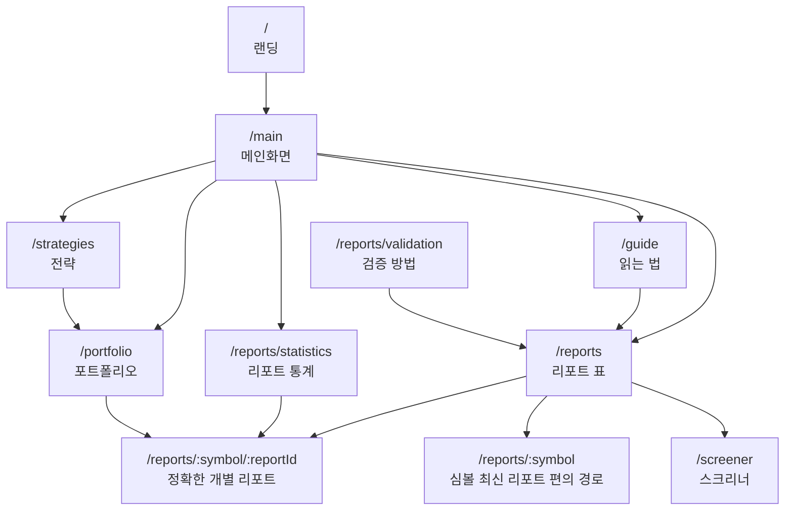
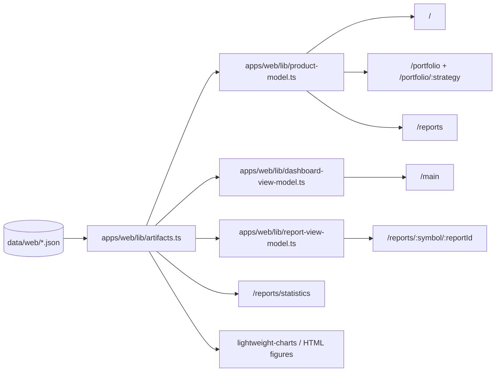

# SNUSMIC Portfolio Lab 페이지·아티팩트 맵

Last updated: 2026-05-19

리포트/통계/포트폴리오 정리 이후의 현재 라우팅·데이터 계약 문서입니다. 진실은 코드이며, 이 맵은 숨겨진 레거시 라우트와 중복 UI 표면이 어긋나지 않도록 유지합니다.

## 라우트 맵

### 라우트 오너십

| 라우트 | 오너 파일 | 역할 | 결정 |
| --- | --- | --- | --- |
| `/` | `apps/web/app/page.tsx` | 공개 랜딩 페이지·앱 진입점 | 유지 |
| `/main` | `apps/web/app/(app)/main/page.tsx` | 제품 메인 대시보드 | 유지 |
| `/portfolio` | `apps/web/app/(app)/portfolio/page.tsx` | 현재 상위 고유 전략을 기본 노출 | 유지 |
| `/portfolio/:strategy` | `apps/web/app/(app)/portfolio/[strategy]/page.tsx` | 선택된 전략의 정확한 원장 페이로드 | 전략 페이지 표준 경로 |
| `/reports` | `apps/web/app/(app)/reports/page.tsx` | 리포트와 후보 표 단일 표면 | 유지 |
| `/reports/statistics` | `apps/web/app/(app)/reports/statistics/page.tsx` | 리서치 형식의 통계 스토리 | 유지 |
| `/reports/validation` | `apps/web/app/(app)/reports/validation/page.tsx` | 방법론 설명 | 유지 |
| `/reports/:symbol` | `apps/web/app/(app)/reports/[symbol]/page.tsx` | 심볼 최신 리포트 편의 경로 | 유지(통계·표 딥링크는 exact 경로 우선) |
| `/reports/:symbol/:reportId` | `apps/web/app/(app)/reports/[symbol]/[reportId]/page.tsx` | 정확한 과거 리포트 정체성 | 상세 페이지 표준 경로 |
| `/screener` | `apps/web/app/(app)/screener/page.tsx` | 후보 탐색용 스프레드시트형 스크리너 | 유지 |
| `/strategies` | `apps/web/app/(app)/strategies/page.tsx` | 전략 리더보드·비교 | 유지 |
| `/guide` | `apps/web/app/(app)/guide/page.tsx` | 사용자 독해 가이드 | 유지 |

## 아티팩트 흐름

## 사용자 질문별 핵심 아티팩트

| 사용자 질문 | 아티팩트 | 표시 UI |
| --- | --- | --- |
| 지금 포트폴리오가 왜 이 금액인가 | `personas.json`, `current-holdings.json`, `accounting-reconciliation.json`, `equity-daily.json`, `trades.json` | `/portfolio/:strategy` |
| 리포트는 얼마나 맞았나 | `reports.json`, `report-statistics-lab.json`, `target-hit-distribution.json` | `/reports/statistics` |
| 개별 리포트가 어떤 경로를 거쳤나 | `reports.json`, `prices/*`, `report-detail-metrics.json` | `/reports/:symbol/:reportId` |
| 어떤 리포트를 다시 봐야 하나 | `reports.json`, `report-rankings.json`, `screener/*` | `/reports`, `/screener` |
| 어떤 전략이 돈을 벌었나 | `personas.json`, `strategies/catalog.json`, `equity-daily.json` | `/portfolio`, `/strategies` |

## 정리 규칙

1. `reportId`가 있을 때는 표/통계 예시를 `/reports/:symbol`로 링크하지 않습니다. 동일 심볼의 다른 리포트와 어긋나지 않도록 정확한 링크를 사용합니다.
2. 누락된 리포트 ID/가격/전략 회계에 조용한 fallback을 넣지 않습니다. 빌드·렌더 단계에서 throw해 아티팩트 버그가 즉시 드러나도록 합니다.
3. 제품 카피에 generic snapshot/terminal 표현을 다시 들이지 않습니다. 메인화면, 포트폴리오, 리포트, 매매내역 같은 평문 한국어 라벨을 우선합니다.
4. 사용되지 않는 레거시 CSS·컴포넌트는 grep과 빌드로 미참조가 증명된 즉시 삭제합니다.
5. 포트폴리오 페이지 페이로드는 선택된 전략 하나로 좁힌 후 비교 벤치마크 equity 곡선만 추가로 통과시킵니다.

## 리포트 상세 (v0.21.4 슬림화 이후)

리포트 상세 페이지는 표 중심으로 다음 다섯 블록만 렌더합니다.

1. 컴팩트 헤더 — 심볼/상태/거래소/통화 배지, 회사명, PDF·Markdown·목록 버튼.
2. 핵심 지표 표 — 발간일/만료일/최근 가격일/발간가/목표가/현재가/상승여력/현재 수익률/최고/최저/목표 도달 단계/도달 정보/포착률/발간 후 고점/저점.
3. 가격 경로 차트 (lightweight-charts) — 주변 산문 없음.
4. 가격대별 사후 수익률 표.

이전의 ReportHero·EvidenceStrip·OutcomePanel·ScenarioPanel·SourcesPanel·TrendSignalCard·SymbolPersonaTrades 등의 산문·카드·바·메모 글머리표·마크다운 미리보기는 모두 제거되었습니다. 전략별 매매는 포트폴리오에서 확인합니다.
